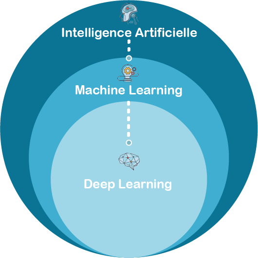
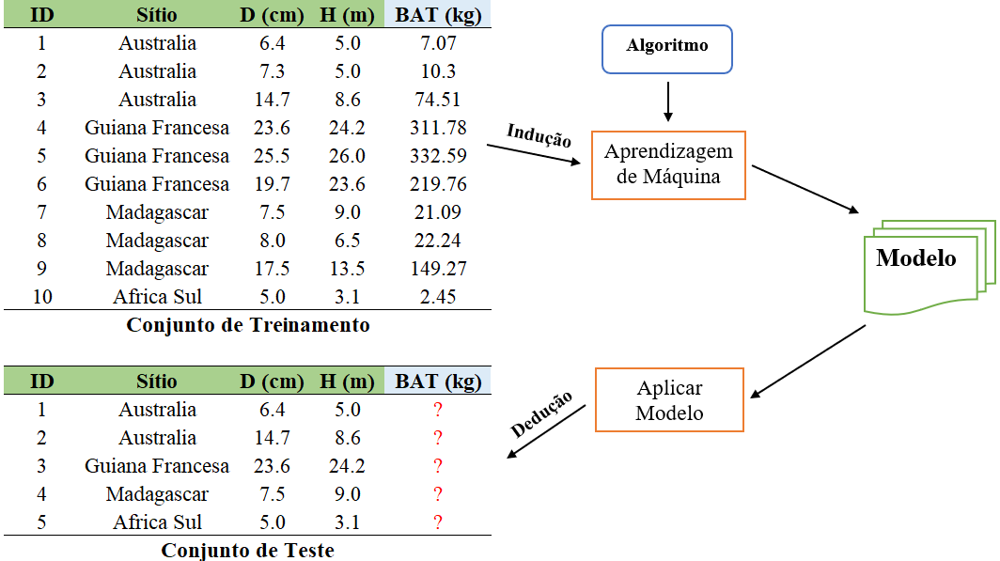
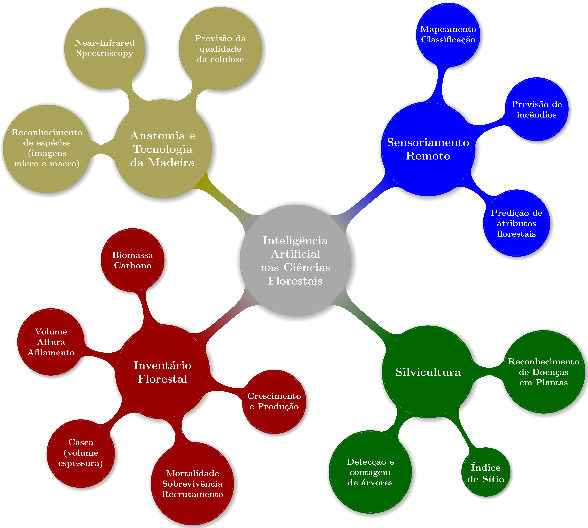
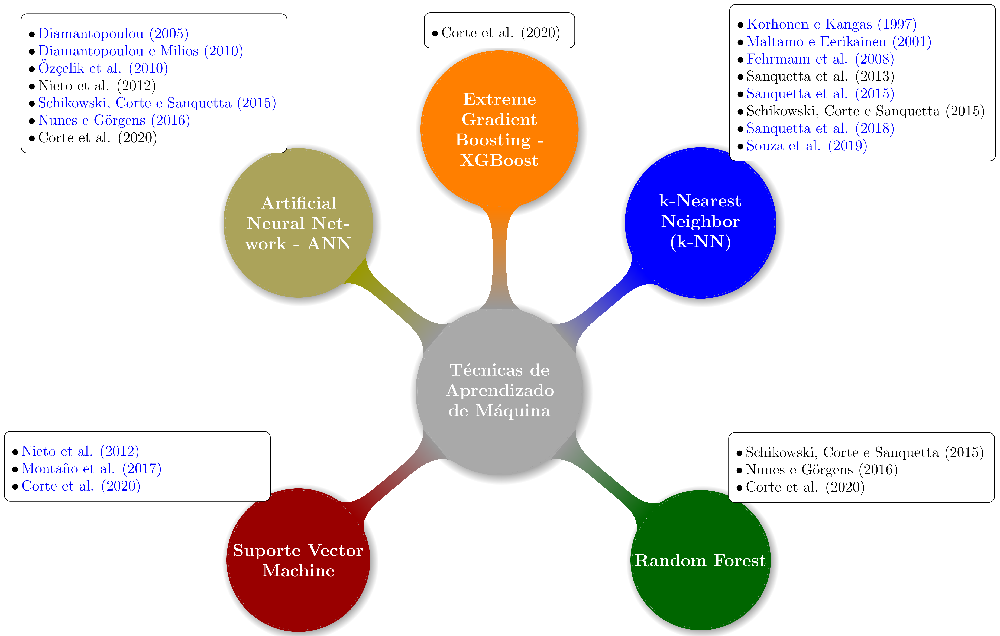
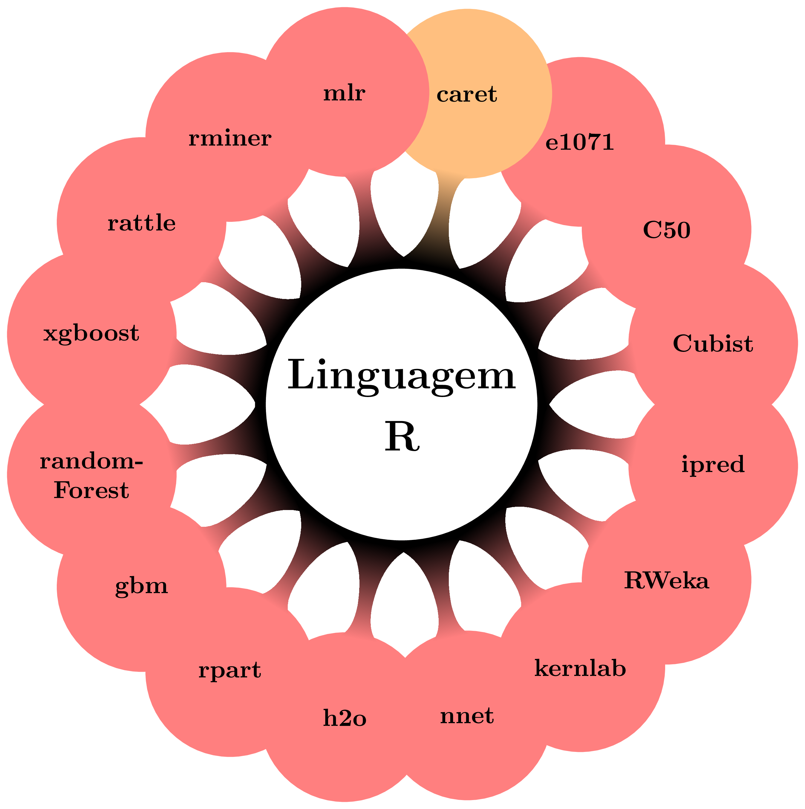
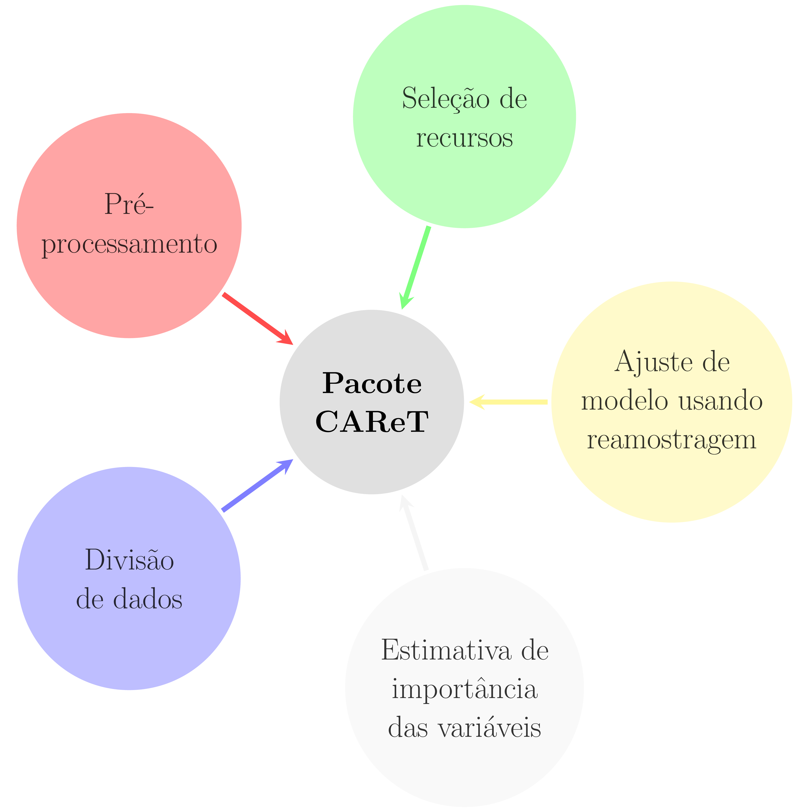
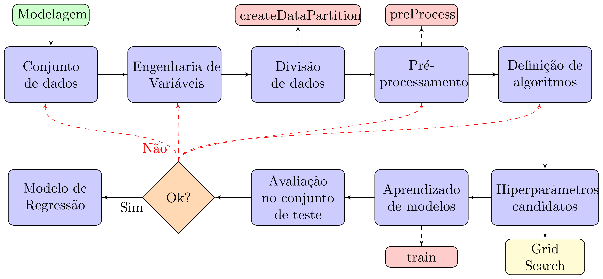

name: toc

```{r setup, include=FALSE}
options(htmltools.dir.version = FALSE, knitr.graphics.auto_pdf = TRUE)
library(tidyverse)

knitr::opts_chunk$set(
  fig.showtext = TRUE,
  fig.width = 16, 
  fig.height = 8, 
  dpi = 600,
  fig.align='center', 
  dev.args=list(bg='transparent')
)

```

```{r xaringanExtra, echo=FALSE}
library(xaringanExtra)
use_logo(
  image_url = "fig/ufpa.png",
  position = css_position(top = ".8em", right = "1em"),
  width = "140px",
  height = "140px"
)

use_extra_styles(
  hover_code_line = TRUE,         #<<
  mute_unhighlighted_code = TRUE  #<<
)

use_tachyons()
use_panelset()
use_clipboard()
style_panelset(panel_tab_color_active = "red")
```

```{r xaringanthemer, warning=FALSE, include=FALSE}
library(xaringanthemer)
style_mono_accent(
  base_color = "#43418A",
  header_font_google = google_font("Josefin Sans"),
  text_font_google   = google_font("Montserrat", "300", "300i"),
  code_font_google   = google_font("Fira Mono")
)
```

```{r, load_refs, include=FALSE, cache=FALSE}
library(RefManageR)
BibOptions(check.entries = FALSE,
           bib.style = "authoryear",
           cite.style = "authoryear",
           style = "html",
           hyperlink = FALSE,
           dashed = FALSE)
(myBib <- ReadBib("./bib/ref.bib", check = FALSE))
```

# 👋 Olá!

## <bdi style="color:magenta;">1. Deivison Souza </bdi>

.pull-left[
* <bdi style="font-weight:bold">Graduação (Titulação: ano 2008)</bdi>
    + Universidade Federal Rural da Amazônia (UFRA); e
    + Título: Bacharel em Engenharia Florestal.

* <bdi style="font-weight:bold">Mestrado (Titulação: ano 2011)</bdi>
    + Universidade Federal Rural da Amazônia (UFRA);
    + Programa de Pós-graduação em Ciências Florestais (PPGCF); e
    + Área de Concentração: Manejo de ecossistemas florestais.
]

.pull-right[
* <bdi style="font-weight:bold">Doutorado (Titulação: ano 2020)</bdi>
    + Universidade Federal do Paraná (UFPR);
    + Programa de Pós-graduação em Engenharia Florestal (PPGEF); e
    + Área de Concentração: Manejo Florestal.
    
* <bdi style="font-weight:bold">Especialização (Defesa: ano 2019)</bdi>
    + Universidade Federal do Paraná (UFPR);
    + Área: Big Data e Data Science
]

---
# 👋 Olá!

.pull-left[
## <bdi style="color:magenta;">2. Interesses atuais</bdi>

* <bdi style="font-weight:bold">Linguagem de programação</bdi>
    + R
    + Python
    
* <bdi style="font-weight:bold">Modelagem preditiva aplicada à ciência florestal</bdi>
    + Aprendizado de máquina
    
* <bdi style="font-weight:bold">Visão computacional</bdi> 
    + reconhecimento de imagens
    
* <bdi style="font-weight:bold">Criação de Dashboard - Shiny</bdi>
]

.pull-right[
## <bdi style="color:magenta;">3. Websites e contatos </bdi>

<html>
<head>
<link rel="stylesheet" href="https://maxcdn.bootstrapcdn.com/font-awesome/4.4.0/css/font-awesome.min.css">
</head>
<body>
<i class="fa fa-github fa-2x"></i>
<!--use the fa-lg (33% increase), fa-2x, fa-3x, fa-4x, or fa-5x classes-->
</body>
</html>
<bdi style="font-weight:bold">GitHub:</bdi> https://github.com/DeivisonSouza

<span class="iconify" data-icon="fa-brands:orcid" data-inline="false"></span>


<div itemscope itemtype="https://schema.org/Person"><a itemprop="sameAs" content="https://orcid.org/0000-0002-2975-0927" href="https://orcid.org/0000-0002-2975-0927" target="orcid.widget" rel="me noopener noreferrer" style="vertical-align:top;">https://orcid.org/0000-0002-2975-0927</a></div>

```{r, echo=FALSE, out.width='20%', fig.align='center', fig.cap=''}
knitr::include_graphics('fig/ORCID.png')
```

Email: deivisonvs@ufpa.br
]

<!-- --- -->
<!-- # A IA está no cotidiano! -->

<!-- * <bdi style="font-weight:bold">1. Reconhecimento Facial</bdi> (Face Recognition) -->

<!--  + Como o `Facebook` é capaz de reconhecer uma pessoa em uma foto? -->

<!-- * <bdi style="font-weight:bold">2. Sistemas de Recomendação</bdi> (*Recommendation Systems*) -->

<!--  + Como o `Google Maps` é capaz de traçar a melhor rota para um destino? -->

<!--  + Como a `NetFlix` faz para recomendar séries e filmes (e outros) para os usuários? [(SR NetFlix)](https://help.netflix.com/pt/node/100639) -->
---
background-image: url(fig/white.jpg)
background-size: cover
# Conteúdo

.pull-left[
[1 - O que é aprendizado de Máquina (AM)](#AM)

[2 - Tipos de Aprendizagem](#tipos)

[3 - Aplicações nas ciências florestais](#aplicacoes)

[4 - Aprendizado de Máquina com linguagem R](#AMLR)

[5 - Pacote CARET](#caret)

[6 - Aprendizado de Máquina no R: exemplo prático](#exemploR)

[7 - Aplicação Web com MAM: um exemplo prático.](#shiny)

]

---
# Aprendizado de Máquina: um subconjunto da IA!

```{r, echo=FALSE, out.width='50%', fig.align='center', fig.cap='', dpi=600}

```
.left[.footnote[Fonte: [Bial-R](https://www.bial-r.com/2019/05/22/comprendre-le-machine-learning-et-le-deep-learning/)]]

---
name: AM
# Aprendizado de Máquina (*Machine Learning*)

.bg-washed-near-white.b--dark-green.ba.bw2.br3.shadow-5.ph4.mt5[
.center[<bdi style="font-weight:bold"> 🤔 *Machine Learning*</bdi>]

<bdi style="font-weight:bold">1959</bdi>: `Arthur Lee Samuel` cunhou pela primeira vez o termo *Machine Learning*.

<bdi style="font-weight:bold">Definição</bdi>: É um `subconjunto de inteligência artificial` que frequentemente usa técnicas estatísticas para dar aos computadores a capacidade de `"aprender"` com dados, sem serem explicitamente programados.

.tr[
— (Parafraseado de Arthur Lee Samuel, 1959)
]

<br>

<bdi style="color:blue;"> *Some Studies in Machine Learning Using the Game of Checkers* </bdi> `r Citep(myBib, "samuel1959some")`.

] 

---
name: tipos
# Tipos de Aprendizagem

```{r, echo=FALSE, out.width='80%', fig.align='center', fig.cap='', dpi=600}
knitr::include_graphics('fig/ML.png')
```
.left[.footnote[Fonte: O Autor.]]

---
name: AS
# Aprendizado Supervisionado

```{r, echo=FALSE, out.width='80%', fig.align='center', fig.cap=''}

```

.left[.footnote[Fonte: O Autor.]] 

---
name: MAM
# Um modelo de aprendizado de máquina: CART

```{r, echo=FALSE, out.width='80%', fig.align='center', fig.cap=''}
knitr::include_graphics('fig/CART.png')
```

.left[.footnote[Fonte: O Autor.]] 

---
name: aplicacoes
# Aplicações nas ciências florestais

```{r, echo=FALSE, out.width='57%', fig.align='center', fig.cap=''}

```

.left[.footnote[Fonte: O Autor.]]

---
name: AMIF
# AM no Inventário Florestal: estudos indicam potencial!

```{r, echo=FALSE, out.width='80%', fig.align='center', fig.cap='', dpi=600}

```
.left[.footnote[Fonte: O Autor.]]

```{r}
Citep(myBib, c("diamantopoulou2010modelling", "nieto2012support", "sanquetta2013use", "diamantopoulou2005artificial", "ozccelik2010estimating", "schikowski2015estudo", "nunes2016artificial", "Corte2020", "montano2017artificial", "korhonen1997application", "maltamo2001most", "fehrmann2008comparison", "sanquetta2015comparison", "sanquetta2018volume", "souza2019"))
```

---
name: AMLR
class: middle, center
# Aprendizado de máquina com linguagem R

.pull-left[

.thick[Alguns pacotes publicados no Cran Task View: Machine Learning & Statistical learning]

```{r, echo=FALSE, out.width='85%', fig.align='center', fig.cap='', dpi=600}

```
]

.pull-right[
<BR> <BR> <BR> <BR> <BR>
.thick[Veja outros pacotes disponíveis em Task View:]

[Machine Learning & Statistical learning](https://cran.r-project.org/)

<BR> <BR>
.thick[Web scraping feito em 21/07/2018:]

Até julho de 2018 existiam 102 pacotes sobre AM
publicados no CRAN Task View.
]

.left[.footnote[Fonte: O Autor.]]

---
name: caret
background-image: url(fig/white.jpg)
background-size: cover

# Pacote CARET: um framework para aprendizado de máquina

.font300[.thick[CARET]]
	
.font200[(.red[C]lassication .red[A]nd .red[Re]gression .red[T]raining)]
	
`r Citep(myBib, c("kuhn2013applied", "R-caret"))`.
		
.font120["Constitui um conjunto de funções que tentam simplificar <br> o processo de construção de modelos preditivos."]

<br> <br> <br>

Web page: [CARET Package](https://topepo.github.io/caret/index.html)

.left[.footnote[Imagem de <a href="https://pixabay.com/pt/users/pen_ash-5526837/?utm_source=link-attribution&amp;utm_medium=referral&amp;utm_campaign=image&amp;utm_content=5358904">pen_ash</a> por <a href="https://pixabay.com/pt/?utm_source=link-attribution&amp;utm_medium=referral&amp;utm_campaign=image&amp;utm_content=5358904">Pixabay</a>]]
---
# Pacote CARET: Ferramentas

```{r, echo=FALSE, out.width='50%', fig.align='center', fig.cap='', dpi=600}

```

---
name: fluxo
background-image: url(fig/white.jpg)
background-size: cover

# Fluxograma - Construção de modelos de AM usando CARET

```{r, echo=FALSE, out.width='90%', fig.align='center', fig.cap=''}

```
.left[.footnote[Fonte: `r Citet(myBib, "souza2020Tese")`.]]

---
name: exemploR
class: inverse, middle, center
background-image: url(fig/imgC.jpg)
background-size: cover

<br> <br> <br> <br> <br>
## .thick[.black[MACHINE LEARNING NO R]]

<br> <br>
.left[.thick[.black[Acesse o R-script:]]

[01-wkNN](https://deivisonsouza.github.io/IA-Potencial-IF/R-scripts/01-wkNN.R)

.thick[.black[Acesse os dados:]]

[Tectona-grandis](https://deivisonsouza.github.io/IA-Potencial-IF/R-scripts/Tectona.csv)]

.left[.footnote[Créditos: Imagem de .green[Willas Lima].]]
---
name: shiny
class: inverse, top
background-image: url(fig/white.jpg)
background-size: cover

## .thick[.black[Como disponibilizar os modelos de aprendizado de máquina?]]

.pull-left[
```{r, echo=FALSE, out.width='20%', fig.align='center', fig.cap=''}

```

.thick[.black[Biblioteca Shiny]]

.black[Biblioteca que facilita a criação de aplicativos da Web interativos usando diretamente a Linguagem R.]

.thick[.black[Shinyapps.io:]]

.black[Servidor gratuito para hospedar os aplicativos Shiny.]
<BR>

.thick[.black[Acesse aplicações Web para predição de biomassa e volume: (Souza, 2020)]]

.font80[
[1-Shiny-MLMBio-Biomassa](https://deivisonsouza.shinyapps.io/MLBiomass/)

[2-Shiny-MLMVol-Volume](https://deivisonsouza.shinyapps.io/MLVolume/)
]
]

.column-right[
.thick[.black[Acesse a base para uso na aplicação MLMBio:]] [Biomass-data](https://deivisonsouza.github.io/IA-Potencial-IF/R-scripts/data.csv)]

]

---
# Referências
<br>

```{r refs1, echo=FALSE, results="asis"}
PrintBibliography(myBib, start = 1, end = 5)
```
---
# Referências
<br>

```{r refs2, echo=FALSE, results="asis"}
PrintBibliography(myBib, start = 6, end = 10)
```
---
# Referências
<br>

```{r refs3, echo=FALSE, results="asis"}
PrintBibliography(myBib, start = 11, end = 15)
```
---
# Referências
<br>

```{r refs4, echo=FALSE, results="asis"}
PrintBibliography(myBib, start = 16, end = 19)
```

---
class: inverse, middle
background-image: url(fig/white.jpg)
background-size: cover

.pull-left[
.font300[.thick[.black[Obrigado!]]] <br> <br> <br> <br>


.left[
.thick[.black[**Contato**:]]

.black[Email:] <a href="mailto:deivisonvs@ufpa.br">deivisonvs@ufpa.br</a>

.black[Github:] <a href="https://github.com/DeivisonSouza">@DeivisonSouza</a>

<br> <br>
.font80[.black[Os códigos e demais arquivos desta apresentação estão disponíveis no repositório GitHub:] [IA-Potencial-IF](https://github.com/DeivisonSouza/IA-Potencial-IF).]

]
]

<!-- # Modelagem preditiva: linguagens (softwares) e frameworks -->

<!-- ```{r, engine='tikz', cache=TRUE, echo=FALSE, out.width='50%', fig.ext = 'png', bg = "transparent"} -->
<!-- \usetikzlibrary{mindmap} -->
<!-- \begin{tikzpicture} -->
<!-- 		[mindmap, -->
<!-- 		every node/.style={concept, execute at begin node=\hskip0pt, font=\bfseries}, -->
<!-- 		root concept/.append style={concept color=black, fill=white, line width=1ex, text=black, font=\huge\bfseries}, -->
<!-- 		method a/.style={concept color=red, line width=1ex, text=white}, -->
<!-- 		method b/.style={concept color=orange, line width=1ex, text=white}, -->
<!-- 		method c/.style={concept color=brown, line width=1ex, text=white}, -->
<!-- 		methods a/.style={concept color=red!50, line width=1ex, text=black}, -->
<!-- 		methods b/.style={concept color=orange!50, line width=1ex, text=black}, -->
<!-- 		methods c/.style={concept color=brown!50, line width=1ex, text=black}, -->
<!-- 		grow cyclic, -->
<!-- 		level 1/.append style={level distance=4.5cm, sibling angle=60}, -->
<!-- 		level 2/.append style={level distance=3cm, sibling angle=45}] -->
<!-- 		\node [root concept] {Liguagens/ \\ Software} % root -->
<!-- 		child [missing] {} -->
<!-- 		child [missing] {} -->
<!-- 		child [missing] {} -->
<!-- 		child [method a] { node {Python} -->
<!-- 			child [methods a] { node {A1} } -->
<!-- 			child [methods a] { node {A2} } -->
<!-- 			child [methods a] { node {A3} } -->
<!-- 			child [methods a] { node {A4} } -->
<!-- 			child [methods a] { node {A5} } -->
<!-- 			child [methods a] { node {A6} } -->
<!-- 			child [methods a] { node {A7} } } -->
<!-- 		child [missing] {} -->
<!-- 		child [method b] { node {R} -->
<!-- 			child [methods b] { node {B1} } -->
<!-- 			child [methods b] { node {B2} } -->
<!-- 			child [methods b] { node {B3} } -->
<!-- 			child [methods b] { node {B4} } -->
<!-- 			child [methods b] { node {B5} } -->
<!-- 			child [methods b] { node {B6} } -->
<!-- 			child [methods b] { node {B7} } } -->
<!-- 		child [missing] {} -->
<!-- 		child [method c] { node {Weka} -->
<!-- 			child [methods c] { node {C1} } -->
<!-- 			child [methods c] { node {C2} } -->
<!-- 			child [methods c] { node {C3} } -->
<!-- 			child [methods c] { node {C4} } -->
<!-- 			child [methods c] { node {C5} } -->
<!-- 			child [methods c] { node {C6} } -->
<!-- 			child [methods c] { node {C7} } }; -->
<!-- 		\end{tikzpicture} -->
<!-- ``` -->


