name: toc

```{r setup, include=FALSE, cache=FALSE, eval=TRUE}
library(tidyverse)
library(rpart)                            
library(rpart.plot)
library(kableExtra)
library(plotly)

options(htmltools.dir.version = FALSE,
        servr.daemon = TRUE)

knitr::opts_chunk$set(
  fig.showtext = TRUE,
  fig.align = "center", 
  cache = TRUE,
  error = FALSE,
  message = FALSE, 
  warning = FALSE, 
  collapse = TRUE ,
  dpi = 600,
  dev.args=list(bg='transparent')
)

```

```{r xaringanExtra, echo=FALSE, eval=TRUE}
library(xaringanExtra)
# use_logo(
#   image_url = "fig/ufpa.png",
#   position = css_position(top = ".8em", right = "1em"),
#   width = "140px",
#   height = "140px"
# )
# 
use_extra_styles(
  hover_code_line = TRUE,         #<<
  mute_unhighlighted_code = TRUE  #<<
)

# use_tachyons()
use_panelset()
# use_clipboard()
#style_panelset(panel_tab_color_active = "red")
```

```{r xaringanthemer, warning=FALSE, include=FALSE}
library(xaringanthemer)
style_mono_accent(
  base_color = "#43418A",
  header_font_google = google_font("Josefin Sans"),
  text_font_google   = google_font("Montserrat", "300", "300i"),
  code_font_google   = google_font("Fira Mono")
)
```

```{r, load_refs, include=FALSE, cache=FALSE}
library(RefManageR)
BibOptions(check.entries = FALSE,
           style = "markdown",
           bib.style = "authoryear",
           cite.style = "authoryear",
           first.inits = TRUE,
           style = "html",
           hyperlink = FALSE,
           dashed = FALSE)
(myBib <- ReadBib("./bib/ref.bib", check = FALSE))
```

# 👋 Olá!

## <bdi style="color:magenta;">1. Deivison Souza </bdi>

.pull-left[
* <bdi style="font-weight:bold">Graduação (Titulação: ano 2008)</bdi>
    + Universidade Federal Rural da Amazônia (UFRA); e
    + Título: Bacharel em Engenharia Florestal.

* <bdi style="font-weight:bold">Mestrado (Titulação: ano 2011)</bdi>
    + Universidade Federal Rural da Amazônia (UFRA);
    + Programa de Pós-graduação em Ciências Florestais (PPGCF); e
    + Área de Concentração: Manejo de ecossistemas florestais.
]

.pull-right[
* <bdi style="font-weight:bold">Doutorado (Titulação: ano 2020)</bdi>
    + Universidade Federal do Paraná (UFPR);
    + Programa de Pós-graduação em Engenharia Florestal (PPGEF); e
    + Área de Concentração: Manejo Florestal.
    
* <bdi style="font-weight:bold">Especialização (Defesa: ano 2019)</bdi>
    + Universidade Federal do Paraná (UFPR);
    + Área: Big Data e Data Science
]

<!-- Slide 2 -->
---
background-image: url(fig/white.jpg)
background-size: cover
# Conteúdo

.pull-top[
**Parte 1 - Conceitos e fundamentação teórica**

[1 - Qual é o motivo de fazer análise de regressão?](#AR)

[2 - Culturas na modelagem estatística](#CultME)

[3 - Aprendizado de Máquina](#AM)

&nbsp;&nbsp;[3.1 - Tipos de Aprendizagem](#TA)

&nbsp;&nbsp;[3.2 - Algoritmos de Aprendizado Supersivionado](#AAS)

&nbsp;&nbsp;&nbsp;&nbsp;[3.2.1 - Regression Tree](#RT)

&nbsp;&nbsp;&nbsp;&nbsp;[3.2.2 - Bagging](#bag)

&nbsp;&nbsp;&nbsp;&nbsp;[3.2.3 - Random Forest](#rf)

&nbsp;&nbsp;&nbsp;&nbsp;[3.2.4 - Outros (M5', ...)](#out)

&nbsp;&nbsp;[3.3 - Métodos de Reamostragem](#mr)

&nbsp;&nbsp;[3.4 - Medidas de Desempenho](#md)

]

<!-- Slide 2 -->
---
background-image: url(fig/white.jpg)
background-size: cover
# Conteúdo

.pull-top[

**Parte 2 - Aprendizado de Máquina com Linguagem R**

[1 - Bibliotecas no Cran Task View](#bctv)

[2 - Pacote CARET](#caret)

[3 - Fluxograma: aprendizado de MAM usando CARET](#fluxo)

[4 - Modelagem no R: uma rápida intuição](#exR)

[5 - Aplicação Web com MAM: demonstração.](#shiny)


**Parte 3 - Aplicações nas Ciências Florestais**

[1 - Aplicações nas ciências florestais](#aplicacoes)

[2 - Considerações finais](#cf)

]

<br> <br>

.left[.footnote[Imagem de <a href="https://pixabay.com/pt/users/pen_ash-5526837/?utm_source=link-attribution&amp;utm_medium=referral&amp;utm_campaign=image&amp;utm_content=5358904">pen_ash</a> por <a href="https://pixabay.com/pt/?utm_source=link-attribution&amp;utm_medium=referral&amp;utm_campaign=image&amp;utm_content=5358904">Pixabay</a>]]


<!-- Slide XX -->
---
name: AR
class: inverse, middle, left
background-image: url(fig/white.jpg)
background-size: cover

.font200[**Parte 1** <br> .green[Conceitos e fundamentação teórica]]

<!-- Slide XX -->
---
name: AR
class: inverse, middle, left
background-image: url(fig/white.jpg)
background-size: cover

.font200[**Qual é o motivo de fazer <br> análise de regressão?**]


<!--Slide 3 -->
---
# Uma análise de regressão...

.pull-left-2[
.blockquote[
.center[**Motivos práticos**]

- **Determinação**: Variáveis difíceis de determinar em campo;
  - ex.: volume, biomassa, altura, etc.
- **Alto custo**: Almeja-se diminuir custos!
- **Larga escala**: Imagine fazer isso em larga escala! É impraticável!
- **Alternativa**: Usar métodos indiretos.
]
]

.pull-right-1[
```{r, echo=FALSE, out.width='50%', fig.align='center', fig.cap='', dpi=600}
knitr::include_graphics('fig/imgCub.jpg')
```
<br>
.center[**Nas florestas inequiâneas as dificuldades octuplicam!**]
]

**Regressão Linear**: Método mais tradicional!

$v = \beta_0 + \beta_{1}(d^2h) + \epsilon_i$ $\Rightarrow$ **Spurr (1952)**

$ln (v) = ln\beta_0 + \beta_{1}ln(d) + \beta_{2}ln(h) + \epsilon_i$ $\Rightarrow$ **Schumacher-Hall (1933)**

<!--Slide 4 -->
---
# Uma análise de regressão...

.blockquote[
.center[**Motivos estatísticos** `r Citep(myBib, "izbicki_mendonca2020")`]

- **Inferencial**: Tirar conclusões sobre a população.
  - Interpretar parâmetros;
  - Estimar os intervalos de confiança (IC) dos parâmetros; e
  - Testes de hipóteses (normalidade, homocedasticidade dos resíduos, etc.) $\Rightarrow$ .content-box-red[Suposições da RL]

*Por exemplo:* Admitindo o modelo $v = \beta_0 + \beta_1d + \epsilon_i$ (**Berkhout**)

Qual a relação entre $v$ e o $d$?

Qual efeito no volume para uma unidade de mudança no diâmetro da árvore?

- **Preditivista**: 
  - Estimar uma função de regressão $f(x)$ com bom poder preditivo! .content-box-red[O foco é na predição!]
]

--

.content-box-blue[
.center[**Portanto, para um determinado problema o foco pode ser claramente inferencial ou preditivo, e para outros pode ser a mistura de ambos** `r Citep(myBib, "izbicki_mendonca2020")`.]
]

<!-- Slide XX -->
---
name: CultME
class: inverse, middle, left
background-image: url(fig/white.jpg)
background-size: cover

.font200[**Culturas na modelagem <br> estatística**]

<!--Slide 5 -->
---
# As duas culturas...`r Citep(myBib, "breiman2001statistical")`

.pull-left-2[
.blockquote[

- **Data modeling culture**
  - *Objetivo principal*: .content-box-red[inferência] (interpretabilidade)
  - *Predomina*: comunidade estatística
  - *População estimada*: 98% de todos os estatísticos
  - *Forma funcional*: suposição da forma funcional $f(x)$ 
  - *Parâmetros*: são estimados a partir dos dados
]

.blockquote[
- **Algorithmic modeling culture**
  - *Objetivo principal*: .content-box-red[predição] (poder preditivo!)
  - *Predomina*: comunidade de aprendizado de máquina
  - *População estimada*: 2% de todos os estatísticos
  - *Forma funcional*: $f(x)$ é desconhecida e complexa
]
]

.pull-right-1[
```{r, echo=FALSE, out.width='70%', fig.align='center', fig.cap='', dpi=600}
knitr::include_graphics('fig/Breiman.jpg')
```
<br>
.center[**Leo Breiman**]
.center[Fonte: [en.wikipedia.org](https://en.wikipedia.org/wiki/Leo_Breiman)]
]

.content-box-blue[.center[Statistical modeling: The two cultures `r Citep(myBib, "breiman2001statistical")`.]
]

<!-- Slide XX -->
---
name: AM
class: inverse, middle, left
background-image: url(fig/white.jpg)
background-size: cover

.font200[**Aprendizado de Máquina** <br> (*Machine Learning*)]

<!--Slide 6 -->
---
# Aprendizado de Máquina (*Machine Learning*)

**História:**
- Surgiu em 1959;
- Arthur Lee Samuel: Cunhou pela primeira vez o termo *Machine Learning*; e
- Manuscrito: .blue[*Some Studies in Machine Learning Using the Game of Checkers*] `r Citep(myBib, "samuel1959some", .opts = list(hyperlink = "to.doc", super = TRUE))`.

--

.pull-left[
.blockquote[
**Definição:** <br>
É um .content-box-red[subconjunto de inteligência artificial] que frequentemente usa técnicas estatísticas para dar aos computadores a capacidade de .content-box-red["aprender"] com dados, sem serem explicitamente programados. <br>

.tr[
— (Parafraseado de Arthur Lee Samuel, 1959)
]
]
]

.pull-right[
Arthur Samuel demonstrates how machine <br> learning can be used to play checkers in 1962.
```{r, echo=FALSE, out.width='80%', fig.align='left', fig.cap='', dpi=600}
knitr::include_graphics('fig/ArtSam.jpg')
```
.left[.footnote[Fonte: [artsandculture.google.com](https://artsandculture.google.com/asset/arthur-samuel-demonstrates-how-machine-learning-can-be-used-to-play-checkers-in-1962-ibm-watson-media/vgH46mpas8dL4g)]]
]

<!--Slide 7 -->
---
# Aprendizado de Máquina (*Machine Learning*)

.pull-left[
.blockquote[
**Tom Mitchel**<br>
Pode-se afirmar que um programa de computador aprende uma
**Experiência E** a respeito de uma **Tarefa T** e alguma medida de **Desempenho P**, se seu desempenho em *T*, medido por *P*, melhora com a experiência *E*.
]
]

.pull-right[
.blockquote[
**Aurélien Géron**<br>
É a ciência (e arte) de programar computadores de tal forma que eles aprendam a partir de dados `r Citep(myBib, "geron2017")`.
]
]

.pull-left-2[
**Tarefa T**: Predizer alguma variável biométrica (ex.: biomassa);

**Medida de Desempenho P**: Alguma função custo (ex.: RMSE); e

**Experiência de treinamento E**: Conjunto de exemplos da variável resposta (ex.: biomassa) e suas potenciais preditoras (ex.: D, H, $\rho$).
]

<!-- Slide XX -->
---
name: TA
class: inverse, middle, left
background-image: url(fig/white.jpg)
background-size: cover

.font180[**Tipos de Aprendizagem** <br> (*Supervisionada vs não-supervisionada*)]

<!--Slide 8 -->
---
# Tipos de Aprendizagem

.pull-left-4[
.blockquote[
.content-box-blue[**Aprendizagem Supervisionada:**]

- **Objetivo principal**:

Dado as medidas $\left(x_1, y_1\right)$, . . . , $\left(x_n, y_n\right)$, o objetivo é estimar uma função $f(x)$ para predizer um novo valor de $y$ baseado em $x$.

- **Tipos de problemas**: classificação e regressão.

- **Variável resposta**: Existe (dados rotulados).
]]

--

.pull-right-4[
.blockquote[
.content-box-blue[**Aprendizagem não-supervisionada:**]
- **Tipos de problemas**: agrupamento, redução de dimensionalidade e associação.
    - **Objetivo principal**: Descobrir estruturas subjacentes;
    - **Variável resposta**: Não existe (dados não rotulados)
]]


<!--Slide 9 -->
---
name: tipos
# Tipos de Aprendizagem

```{r, echo=FALSE, out.width='80%', fig.align='center', fig.cap='', dpi=600}
knitr::include_graphics('fig/ML.png')
```
.left[.footnote[Fonte: O Autor.]]

<!--Slide 10 -->
---
# A ideia de "Supervisionar"...

.blockquote[
**Em um conjunto de dados...** <br>

(..) para cada observação de preditora(s), $x_{i}$ (i = 1, ..., n), existe uma resposta associada $y_{i}$ `r Citep(myBib, "james2013introduction", .opts = list(max.names = 1, longnamesfirst = F))`.
] <br>

\[
\normalsize
\underbrace{
\overbrace{\begin{bmatrix}
x_{11} & x_{12} & \cdots & x_{1n} \\
x_{21} & x_{22} & \cdots & x_{2n} \\
\vdots & \vdots & \ddots & \vdots \\
x_{n1} & x_{n2} & \cdots & x_{nn}
  \end{bmatrix}
    }^{\mathbf{X}}
    }_{\mathbf{Preditoras}}
\underbrace{
\overbrace{
  \begin{bmatrix}
    y_1     \\
    y_2     \\
    \vdots  \\
    y_n     \\
  \end{bmatrix}
    }^{\mathbf{y}}
    }_{\mathbf{Resposta}}
\]

.blockquote[
**O papel de Supervisor...** <br>
A ideia é que cada $y_{i}$ exerça um papel de .content-box-red[“Professor”], responsável por .content-box-red[“Supervisionar”] o processo de aprendizagem de uma
função $f(x)$ `r Citep(myBib, "hastie2016elements")`.
]

<!--Slide 11 -->
---
# Um conjunto de dados...

.pull-left[
.center[**Cubagem por Smalian**] 

.scroll-box-20[
```{r, echo=FALSE, eval=TRUE, message=FALSE}
library(kableExtra)
data <- data.table::fread("R-scripts/Cedrela.csv")

data %>% kable(format= "html") %>%
  kable_styling(full_width = F, bootstrap_options = c("striped", "hover", "condensed"), font_size = 18)
```
]]
.pull-right[
.center[**Terminologias**] 

.blockquote[
1. Comunidade de aprendizado de máquina:
- **Instâncias/exemplos**: dados individuais.
- **Atributos/características/features:**
    - Características mensuráveis de uma instância.
- **Variável resposta/labels/classe**: 
    - Variável de interesse para predição.

*Tipos de atributos*: binários, categóricos, numéricos
]]

<!--Slide 12 -->
---
# Até aqui...
<br>

.pull-left-2[
.blockquote[
- **Motivos para fazer regressão**: práticos e estatísticos;

- **Duas Culturas no uso de ME**: DMC e .content-box-red[AMC];

- **Algorithmic modeling culture**: relaciona-se ao campo de .content-box-red[Aprendizado de Máquina];

- **Tipos de Aprendizado**: .content-box-red[Supervisionado] e Não-Supervisionado;

- **Aprendizado Supervisionado**: estimar uma função $f(x)$ para predizer um novo valor de $y$ baseado em $x$. Se $y$ for um número real (númerico) tem-se um .content-box-red[problema de regressão].
]
]<br>

.center[
.font150[
Quais algoritmos existentes para estimar $\Large{f\left(x\right)}$?
]
]

<!-- Slide XX -->
---
name: AAS
class: inverse, middle, left
background-image: url(fig/white.jpg)
background-size: cover

.font180[**Algoritmos de Aprendizado <br> Supersivionado**]

<!--Slide 13 -->
---
# Algoritmos de AS
**- Alguns dos principais algoritmos para problemas de regressão:**
.pull-left[
```{r, echo=FALSE, out.width='110%', fig.align='center', fig.cap='', dpi=600}
knitr::include_graphics('fig/Tec.png')
```
.left[.footnote[Fonte: O Autor.]]
]

--

.pull-rigth[
.center[**Pacote CARET** <br>

Mais de 200 algoritmos para aprendizado supervisionado.

`r Citep(myBib, c("kuhn2013applied", "R-caret"))` <br>

Web page: [CARET Package](https://topepo.github.io/caret/index.html)

]
]

<!--Slide 14 -->
---
name: RT
class: inverse, middle, left
background-image: url(fig/white.jpg)
background-size: cover

.font200[**Regression Tree**]

.font150[(.red[C]lassification .red[A]nd .red[R]egression .red[T]rees - CART)]

`r Citep(myBib, "breiman1984classification", .opts = list(max.names = 1, longnamesfirst = F))`

<!--Slide 15-->
---
# Regression Tree (CART)

.pull-left-1[
```{r, echo=FALSE, out.width='80%', fig.align='center', fig.cap='', dpi=600}
knitr::include_graphics('fig/CART-Book.jpg')
```
.center[Fonte: [www.amazon.com.br](https://www.amazon.com.br/Classification-Regression-Trees-Leo-Breiman/dp/0534980546)]
]

.pull-right-2[
**Informações gerais:**
- **CART**: algoritmo mais famoso;
- **Significado:** .red[C]lassification .red[A]nd .red[R]egression .red[T]rees;
- **Proposto**: `r Citet(myBib, "breiman1984classification", .opts = list(max.names = 1, longnamesfirst = F))`;
- **Problemas**: Classificação e Regressão; e
- **Hiperparâmetro tuning**: .red[cp] (parâmetro de complexidade).

]

<!--Slide 16 -->
---
# Regression Tree (CART)

.pull-left-2[
.blockquote[
- **Qual a ideia principal:**

  - Realizar **particionamentos recursivos** no espaço das covariáveis, e ajustar um **modelo constante** da variável resposta em cada partição. <br>


- **Motivo**:
  - Encontrar partição em que as observações sejam mais **homogêneas** o possível para a **variável resposta**. <br>


- **Covariáveis**: categóricas, dicotômicas, discretas ou contínuas.
]
]

<!--Slide 17 -->
---
# Regression Tree (CART)

.pull-left-3[
.blockquote[
**Estrutura:** <br>

1) **Nó raiz** (*root node*): $R_{1}$

2) **Nó intermediário** (*intermediate node*): $I_{2}$, $I_{3}$ e $I_{7}$

3) **Nó terminal** ou **folha** (*leaf* or *terminal node*): $T_{4}$, $T_{5}$, $T_{6}$, $T_{8}$ e $T_{9}$

4) **Divisões** (*splits*): $d_{1}$, $d_{2}$, $d_{3}$ e $d_{4}$ (condições "se-então")
]

--

.pull-bottom[
.blockquote[
- **Etapas do aprendizado**:

  1) Crescimento de uma árvore completa (adulta) até algum critério de parada; e
  
  2) Poda da árvore (overfitting).
]
]


]

.pull-right-3[
.center[**Uma árvore de regressão...**]

```{r, echo=FALSE, out.width='100%', fig.align='center', fig.cap='', dpi=600}
knitr::include_graphics('fig/CART1.png')
```
.left[.footnote[Fonte: Adaptado de Breiman et al. (1984).]]
]

<!--Slide 15 -->
---
# Regression Tree: Como uma árvore cresce?

.panelset[
.panel[.panel-name[Dados]
.pull-left[

.scroll-box-20[
```{r, echo=FALSE, eval=TRUE, message=FALSE}
data <- data.table::fread("R-scripts/Cedrela.csv")

data %>% kable(format= "html") %>%
  kable_styling(full_width = F, bootstrap_options = c("striped", "hover", "condensed"), font_size = 18)

```
]]
.pull-right[
**Meta**: Estimar uma função de regressão $f(x)$ usando o algoritmo CART para predizer o volume $\left(\normalsize V = f(D,H)\right)$

**Foco**: Como é o processo de crescimento de uma árvore CART?

]
]

.panel[.panel-name[CART]
.pull-left[
```{r, echo=FALSE, fig.width=5, fig.height=3, warning=FALSE, fig.align='center', fig.cap='Árvore CART (rpart/cp = 0/minsplit = 20)', dpi=600, eval=TRUE, message=FALSE}
set.seed(1)
data2 <- data %>% select(-Arv)

tree <- rpart(V ~ ., 
              data = data2, 
              method="anova", 
              control = rpart.control(cp = 0, minsplit = 20))

rattle::fancyRpartPlot(tree,
                       yesno=2,
                       split.col="black",
                       nn.col="black",
                       caption="",
                       palette="Set2",
                       branch.col="black",
                       digits = 4)

# rpart.plot(tree, box.palette="RdBu", shadow.col="gray", nn=TRUE, digits = 4)
```
*minsplit* = Mínimo de 20 observações p/ tentar uma divisão
]

.pull-right[
.scroll-box-20[
.shadow[
**1) Início**
- Nó raiz (todas instâncias)/(**n = 32**)
- Cálculos: 
  - Média aritmética da resposta (melhor ``chute''); 
  **5.724 m`r knitr::asis_output("\U00B3")`**
  
  - Soma de Quadrados de Resíduos (SQR). **326.19 (m`r knitr::asis_output("\U00B3")`)`r knitr::asis_output("\U00B2")`**

\begin{equation}
SQR = \sum_{i=1}^{n}(y_{i} - \hat{f_{m}}(x_{i}))^{2}
\end{equation}

$\hat{f_{m}}(x_{i})$: predição na região $m$ em que a i-ésima observação é alocada.
]

.shadow[
**2) Primeira divisão** 
- Qual divisão selecionar?
  - Maior redução da SQR: Qual variável e ponto de corte?
  
  1) Variável escolhida: **D (diâmetro)**
  
  2) Ponto de corte: **95.97cm**
  
- Qual SQR p/ nós filhos?
    - $SQR_{N_{2}}$: 
    **64.39 (m`r knitr::asis_output("\U00B3")`)`r knitr::asis_output("\U00B2")`**
    - $SQR_{N_{3}}$: 
    **93.88 (m`r knitr::asis_output("\U00B3")`)`r knitr::asis_output("\U00B2")`**
    
\begin{equation}
{\Delta R(s,t)} = R(t) - (R(t_L) + R(t_R)) \\
\end{equation}

 = **326.19280 - (64.39354 + 93.87834)**
 
 = **`r tree$frame$dev[1] - (tree$frame$dev[2] + tree$frame$dev[5])` (m`r knitr::asis_output("\U00B3")`)`r knitr::asis_output("\U00B2")`**

]

.shadow[
**3) Segunda divisão**
   
  1) Variável escolhida: **D (diâmetro)**
  
  2) Ponto de corte: **79.74cm**
  
- Qual SQR p/ nós filhos?
    - $SQR_{N_{4}}$: 
    **17.41 (m`r knitr::asis_output("\U00B3")`)`r knitr::asis_output("\U00B2")`**
    - $SQR_{N_{5}}$: 
    **13.90 (m`r knitr::asis_output("\U00B3")`)`r knitr::asis_output("\U00B2")`**
    
\begin{equation}
{\Delta R(s,t)} = R(t) - (R(t_L) + R(t_R)) \\
\end{equation}

 = **64.39354 - (17.40637 + 13.89782)**
 
 = **`r tree$frame$dev[2] - (tree$frame$dev[3] + tree$frame$dev[4])` (m`r knitr::asis_output("\U00B3")`)`r knitr::asis_output("\U00B2")`**

]   

.shadow[
.center[**Resumindo**]

O uso de cp=0 permitiu o crescimento de uma árvore sem restrições, comumente chamada "árvore adulta". Também, minsplit = 20 impôs a condição de existir no mínimo 20 observações em um nó para que uma divisão fosse tentada.

- *Estrutura*: 
    - Duas divisões binárias;
    - Três nós terminais (*);
    - Quatro regras do tipo if-then (Se então); e
    - Somente a variável D (diâmetro) foi escolhida.
]
  
]]]

.panel[.panel-name[Regras]

```{r, echo=FALSE, out.width='40%', fig.align='center', fig.cap='', dpi=600}
print(tree)
rpart.rules(tree, cover = TRUE)
```

]

.panel[.panel-name[SQR-N1]

.pull-left[

.scroll-box-20[
```{r, echo=FALSE, eval=TRUE, message=FALSE}
library(kableExtra)
data <- data.table::fread("R-scripts/Cedrela.csv")

data %>% 
  arrange(D) %>%
  mutate("yi-fm" = V-mean(data$V)) %>%
  mutate("(yi-fm)²" = (V-mean(data$V))^2) %>%
  janitor::adorn_totals("row") %>%
  #rmarkdown::paged_table()
  kable(format= "html") %>%
  kable_styling(full_width = F, bootstrap_options =
                  c("striped", "hover", "condensed"), 
                font_size = 18) %>%
  row_spec(33, bold = T, 
           color = "white", background = "black") %>%
  row_spec(25, bold = T,
           color = "white", background = "orange") %>%
  row_spec(26, bold = T,
           color = "white", background = "orange")
```

]]

.pull-right[
- **1) Início**:

$\bar{V}$ = `r mean(data$V)`;

$SQR_{N_{1}}$ = `r sum((data$V-mean(data$V))^2)`

Ponto de corte: (95.49 + 96.45)/2 = **95.97cm**
]
]

.panel[.panel-name[SQR-N2-N3]

.pull-left[

.scroll-box-20[
```{r, echo=FALSE, eval=TRUE, message=FALSE}
df <- data %>% arrange(D) %>%
  filter(D < 95.97) %>%
  mutate("yi-fm" = V-mean(V)) %>%
  mutate("(yi-fm)²" = (V-mean(V))^2)

df %>%
  janitor::adorn_totals("row") %>%
  kable(format= "html") %>%
  kable_styling(full_width = F, bootstrap_options =
                  c("striped", "hover", "condensed"),
                font_size = 18) %>%
  row_spec(26, bold = T,
           color = "white", background = "black") %>%
  row_spec(16, bold = T,
           color = "white", background = "orange") %>%
  row_spec(17, bold = T,
           color = "white", background = "orange")
```

]]

.pull-right[
```{r, echo=FALSE, eval=TRUE, message=FALSE}
df2 <- data %>% arrange(D) %>%
  filter(D >= 95.97) %>%
  mutate("yi-fm" = V-mean(V)) %>%
  mutate("(yi-fm)²" = (V-mean(V))^2)

df2 %>% 
  janitor::adorn_totals("row") %>%
  kable(format= "html") %>%
  kable_styling(full_width = F, bootstrap_options =
                  c("striped", "hover", "condensed"),
                font_size = 18) %>%
  row_spec(8, bold = T,
           color = "white", background = "black")
```

.pull-bottom[
Ponto de corte: **79.74cm**

$SQR_{N_{2}}$ = `r sum((df$V-mean(df$V))^2)`;
$\bar{V}$ = `r mean(df$V)`

$SQR_{N_{3}}$ = `r sum((df2$V-mean(df2$V))^2)`;
$\bar{V}$ = `r mean(df2$V)`

]
]
]

.panel[.panel-name[SQR-N4-N5]

.pull-left[

.scroll-box-20[
```{r, echo=FALSE, eval=TRUE, message=FALSE}
df4 <- data %>% arrange(D) %>%
  filter(D < 79.74) %>%
  mutate("yi-fm" = V-mean(V)) %>%
  mutate("(yi-fm)²" = (V-mean(V))^2) 

df4 %>%
  janitor::adorn_totals("row") %>%
  kable(format= "html") %>%
  kable_styling(full_width = F, bootstrap_options =
                  c("striped", "hover", "condensed"),
                font_size = 18) %>%
  row_spec(17, bold = T,
           color = "white", background = "black")
```

]

.pull-bottom[
Ponto de corte: **79.74cm**

$SQR_{N_{4}}$ = `r sum((df4$V-mean(df4$V))^2)`;
$\bar{V}$ = `r mean(df4$V)`
]
]

.pull-right[
```{r, echo=FALSE, eval=TRUE, message=FALSE}
df5 <- data %>% arrange(D) %>%
  filter(D >= 79.74 & D < 95.97) %>%
  mutate("yi-fm" = V-mean(V)) %>%
  mutate("(yi-fm)²" = (V-mean(V))^2)

df5 %>%
  janitor::adorn_totals("row") %>%
  kable(format= "html") %>%
  kable_styling(full_width = F, bootstrap_options =
                  c("striped", "hover", "condensed"),
                font_size = 18) %>%
  row_spec(10, bold = T,
           color = "white", background = "black")
```

.pull-bottom[

$SQR_{N_{5}}$ = `r sum((df5$V-mean(df5$V))^2)`;
$\bar{V}$ = `r mean(df5$V)`

]
]
]

.panel[.panel-name[Regiões]

```{r, echo=FALSE, eval=TRUE, fig.width=7, fig.height=2, dpi=600}
data <- data.table::fread("R-scripts/Cedrela.csv")

r1 <- data %>% 
  ggplot() + 
    geom_point(data=data, aes(x=D, y=V, color=ifelse(data$D >= tree$splits[1,4], "red", "black")), size=1) +
  geom_vline(xintercept=tree$splits[1,4], colour="red", linetype="dotted") +
  scale_colour_manual(values = c("black", "red")) +
  geom_text(aes(x=tree$splits[1,4], y=15, 
                label="D >= 95.97"), colour="red", 
            angle=90, vjust = 1.2, size = 4) +
  theme(legend.position="none")

r2 <- r1 + 
  geom_point(data=data, aes(x=D, y=V, colour=ifelse(D < tree$splits[3,4], "blue", ifelse(D >= tree$splits[1,4], "red", "black"))), size=1) +
  scale_colour_manual(values = c("blue", "black", "red"))+
  geom_vline(xintercept=tree$splits[3,4], colour="blue", linetype="dotted") +
    geom_text(aes(x=tree$splits[3,4], y=15, 
                label="D >= 79.74"), colour="blue", 
            angle=90, vjust = 1.2, size = 4) +
  theme(legend.position="none")

r3 <- r2 + 
  geom_text(aes(x=65, y=10, label="R4 \n Vest. = 3.65"), colour="black", 
            vjust = 1.2, size = 2) +
  geom_text(aes(x=87, y=10, label="R5 \n Vest. = 6.05"), colour="blue", 
            vjust = 1.2, size = 2) +
  geom_text(aes(x=123, y=10, label="R3 \n Vest. = 10.05"), colour="red", 
            vjust = 1.2, size = 2)

ggpubr::ggarrange(r1, r2, r3, ncol=3,
                  labels=c("", ""),
                  font.label=list(size=30))
```

]

.panel[.panel-name[f(x)]
.pull-left-2[
```{r, echo=FALSE, fig.align='center', fig.width=5, fig.height=3, fig.cap='', dpi=600, eval=TRUE, warning=FALSE, message=FALSE}

r2 + geom_line(aes(x = D, y = predict(tree)))

```
]
]
]

<!-- Slide XX -->
---
# Underfitting e Overfitting
<br>
São conceitos estatísticos relacionados ao ajuste dos modelos.

- **Subajuste** (*Underfitting*)
  - Quando o modelo aprendido produz **predições ruins** no **conjunto de treinamento**, ou seja o modelo é simples demais para explicar os dados usados no processo de aprendizado.

- **Sobreajuste** (*Overfitting*)
  - Quando o modelo aprendido produz **boas predições** no **conjunto de treinamento** (se ajusta demais aos dados de treino), porém **não generaliza bem para novos dados**.

**Ideal**: Encontrar um modelo intermediário entre subajuste e superajuste!

<!-- Slide XX -->
---
# Underfitting e Overfitting
<br>
Árvores de regressão têm tendência de sobreajustar.

.pull-left[
```{r, echo=FALSE, fig.height=.5, fig.width=.5, fig.cap=""}
bio <- data.table::fread("R-scripts/AGB.csv")

rpart2 <- rpart(AGB ~ D,
                data = bio,
                control = list(cp = 0, maxdepth = 10,
                               minbucket = 1, minsplit = 5))

gg1 <- plot_ly(bio, x = ~D, y = ~AGB, 
               name = 'AGB', 
               type = 'scatter', 
               mode = 'markers') %>% 
  layout(title="",
         font = list(size = 14),
         xaxis=list(title="Diâmetro (cm)"),
         yaxis=list(title="Biomassa Aérea Total (kg)"),
          annotations = list(
            x = 50,
            y = 70000, 
            text = "Overfitting",
            showarrow = FALSE,
             font = list(color = '#264E86',
                         family = 'sans serif',
                         size = 20))) %>%
  add_lines(y = ~predict(rpart2), 
            name = 'AGBest', 
            mode = 'lines')

htmltools::tagList(gg1)

```

]

.pull-right[
```{r, echo=FALSE, out.width='80%', fig.cap=""}
rpart3 <- rpart(AGB ~ D, 
                data = bio, 
                control = list(cp = 0, maxdepth = 2, 
                               minbucket = 1, minsplit = 5))

gg2 <- plot_ly(bio, x = ~D, y = ~AGB, 
               name = 'AGB', 
               type = 'scatter', 
               mode = 'markers') %>% 
  layout(title="",
         font = list(size = 14),
         xaxis=list(title="Diâmetro (cm)"),
         yaxis=list(title="Biomassa Aérea Total (kg)"),
          annotations = list(
            x = 50,
            y = 70000, 
            text = "Underfitting",
            showarrow = FALSE,
             font = list(color = '#264E86',
                         family = 'sans serif',
                         size = 20))) %>%
  add_lines(y = ~predict(rpart3), 
            name = 'AGBest', 
            mode = 'lines')

htmltools::tagList(gg2)
```

]

<!-- Slide XX -->
---
# Overfitting: como minimizar?
<!-- Código adaptado de Bradley boehmke. Disponível em: link: https://github.com/bradleyboehmke/random-forest-training/blob/master/docs/slides-source.Rmd -->

.pull-left-4[
Duas estratégias principais:

**1) Parada antecipada**

  - Restringir a profundidade máxima da árvore (maxdepth); e
  
  - Restringir o número mínimo de observações em qualquer nó terminal (minbucket).

]

.pull-right-4[
```{r, echo=FALSE, out.width='100%', cache=TRUE}
library("gganimate")
library("gifski")
library("transformr")

bio <- data.table::fread("R-scripts/AGB.csv")
maxdepth <- 1:12
results <- data.frame(NULL)

for(i in maxdepth) {
 ctrl <- list(cp = 0, maxdepth = i, 
              minbucket = 1, minsplit = 5)
 fit <- rpart(AGB ~ D, data = bio, control = ctrl) 
 
 pred <- mutate(bio, maxdepth = maxdepth[i])
 pred$pred <- predict(fit, bio)
 results <- rbind(results, pred)
   
}

p <- results %>%
  ggplot(aes(D, pred)) +
  geom_point(aes(D, AGB), alpha = .3, size = 2) +
  geom_line(color = "red", size = 1) +
  ylab("Biomassa Aérea Total (kg)") + 
  xlab("Diâmetro (cm)") + 
  labs(title = 'Profundidade máxima: {frame_time}') +
  transition_time(maxdepth)
  animate(p, renderer = gifski_renderer(), device = "png")
```  

]

<!-- Slide XX -->
---
# Overfitting: como minimizar?

.pull-left-4[
Duas estratégias principais:

**1) Parada antecipada**

  - Restringir a profundidade máxima da árvore (maxdepth); e
  
  - Restringir o número mínimo de observações em qualquer nó terminal (minbucket).

]

.pull-right-4[
```{r, echo=FALSE, out.width='100%', cache=TRUE}
minbucket <- 1:20
results <- data.frame(NULL)

for(i in minbucket) {
 ctrl <- list(cp = 0, maxdepth = 10, 
              minbucket = i, minsplit = 5)
 fit <- rpart(AGB ~ D, data = bio, control = ctrl) 
 
 pred <- mutate(bio, minbucket = minbucket[i])
 pred$pred <- predict(fit, bio)
 results <- rbind(results, pred)
   
}

p <- results %>%
  ggplot(aes(D, pred)) +
  geom_point(aes(D, AGB), alpha = .3, size = 2) +
  geom_line(color = "red", size = 1) +
  ylab("Biomassa Aérea Total (kg)") + 
  xlab("Diâmetro (cm)") + 
  labs(title = 'Número mínimo de observações no nó terminal: {frame_time}') +
  gganimate::transition_time(minbucket)
  animate(p, renderer = gifski_renderer(), device = "png")
```  

]

<!-- Slide XX -->
---
# Overfitting: como minimizar?
<br>

Duas estratégias principais:

.pull-left[
**2) Poda custo complexidade**

  - Cresce uma árvore adulta (complexa).
  
  - As partições são sucessivamente desfeitas (podada) para encontrar uma subárvore ótima; e
  
  - Função de custo-complexidade: $R_{α}(T) = R(T) + α|T|$
]

.pull-right[

.blockquote[
.center[**Termos**]

  $T$: representa uma árvore;
  
  $|T|$: número de nós terminais;
  
  $R(T)$: soma de quadrados de resíduos; e
  
  $α$: Parâmetro custo complexidade (controla complexidade). Hiperparâmetro tuning.
  
  Se $α = 0$ $\rightarrow$ a melhor árvore será a maior árvore.

  **Validação cruzada**: Usada para encontrar o melhor $α$ (a melhor subárvore).
]
]

<!-- Slide XX -->
---
# Regression Tree: pontos fortes e fracos...

.pull-left-4[
```{r, echo=FALSE, out.width='100%', fig.align='center', fig.cap='', dpi=600}
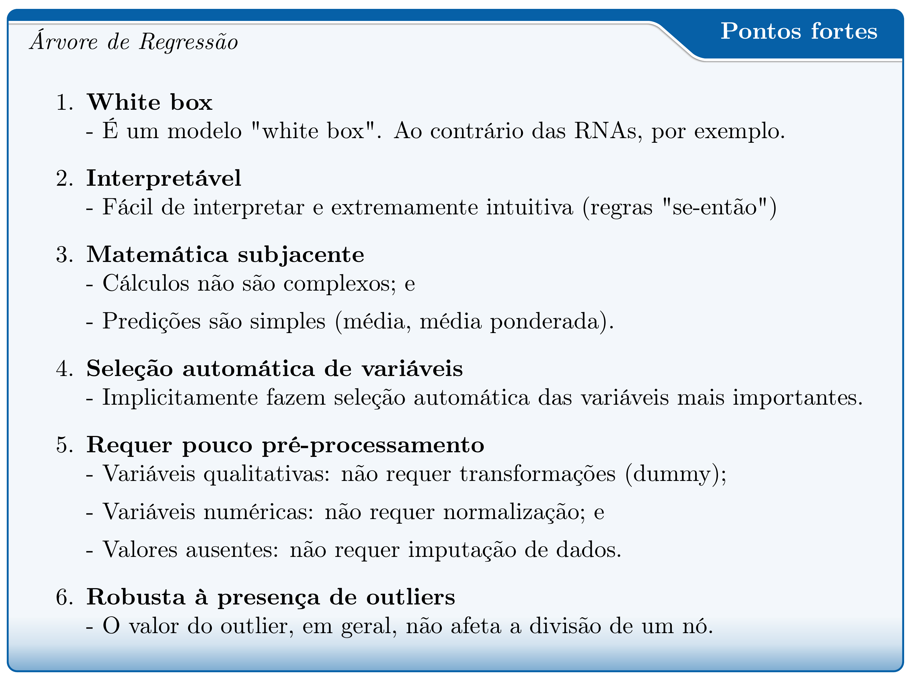
```
.left[**Fonte**: O Autor.]
]

--

.pull-right-4[
```{r, echo=FALSE, out.width='100%', fig.align='center', fig.cap='', dpi=600}
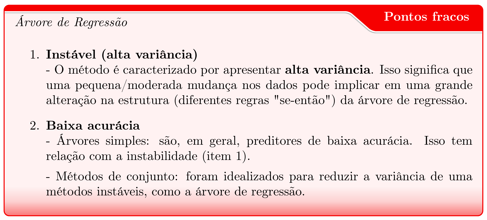
```
]

<!-- Slide XX -->
---
name: bag
class: inverse, middle, left
background-image: url(fig/white.jpg)
background-size: cover

.font200[**Bagging**]

.font150[(.red[B]ootstrap .red[Agg]regat.red[ing])]

`r Citep(myBib, "breiman1996bagging", .opts = list(max.names = 1, longnamesfirst = F))`

<!-- Slide 17 -->
---
# Bagging

.pull-left-1[
```{r, echo=FALSE, out.width='80%', fig.align='center', fig.cap='', dpi=600}
knitr::include_graphics('fig/Breiman1996.png')
```
.center[Fonte: [link.springer.com](https://link.springer.com/article/10.1007/BF00058655)]

]

.pull-right-2[
**Informações gerais:**
- **Bagging**: um dos primeiros algoritmo de conjunto (ensemble);
- **Significado:** .red[B]ootstrap .red[Agg]regat.red[ing];
- **Proposto**: `r Citet(myBib, "breiman1996bagging")`;
- **Problemas**: Classificação e Regressão; e
- **Hiperparâmetro tuning**: .red[nbagg] (número de replicações de bootstrap);
]


<!--Slide 18 -->
---
# Bagging

.pull-left-2[
.blockquote[
- **Ideia principal:**

  - Ajustar múltiplas versões de um modelo preditivo, e depois agregá-las, para obter uma única predição combinada `r Citep(myBib, "breiman1996bagging")`.<br>


- **Motivos**:
  - Reduzir a variância de um método de predição, como as árvores de regressão, e promover melhorias substanciais na acurácia `r Citep(myBib, "james2013introduction", .opts = list(max.names = 1, longnamesfirst = F))`.<br>
  
  
- **Aprediz de base**:
  - Métodos de alta variância (e baixo viés) (ex.: árvores de regressão). <br>
  
    <!-- - **Vantagens**: Ajuda a reduzir a variação, minimizar o overfitting (sobreajuste) e, por conseguinte, melhorar o desempenho preditivo. <br> -->
]
]


---
# Método Bootstrap

.pull-left-3[
.blockquote[
É um **método de reamostragem** que consiste em **produzir replicações** de tamanho $n$, com mesmo tamanho do conjunto de aprendizado, por **amostragem aleatória com reposição** `r Citep(myBib, "gama2015extraccao", .opts = list(max.names = 1, longnamesfirst = F))`.
]
]

.pull-bottom[
```{r, echo=FALSE, out.width='70%', fig.align='center', fig.cap='', dpi=600}
knitr::include_graphics('fig/Bootstrap.png')
```
.footnote[Fonte: Adaptado de [texample.net](https://texample.net/tikz/examples/bootstrap-resampling/)
]

]


<!--Slide XX -->
---
# Bagging (Bagged Trees)

.pull-left-2[
.blockquote[
O bagging pode ser usado para combinar **árvores modelos** `r Citep(myBib, "witten2017data", .opts = list(max.names = 1, longnamesfirst = F))`, e mais comumente **árvores de decisão** `r Citep(myBib, "james2013introduction", .opts = list(max.names = 1, longnamesfirst = F))`.
]
]

--

.pull-right-2[
**Cada árvore crescida possui alta variância, mas baixo viés.**
.blockquote[
**No caso de regressão (usando árvores)...**

**Passo 1** - Dado um conjunto de treinamento original $L$ de tamanho $n$, gerar uma amostra *bootstrap* $bi$ de tamanho $n$;

**Passo 2** - Treinar um modelo de árvore de regressão completamente crescida (profundas e não podadas) usando a amostra *bootstrap* $bi$; e

**Passo 3** - Salvar o modelo preditivo.

Esse procedimento pode ser realizado $B$ vezes. Em que: $B$ = número de amostras bootstrap.
]
]


<!--Slide XX -->
---
# Bagging (Bagged Trees)

```{r, echo=FALSE, out.width='100%', fig.align='center', fig.cap='', dpi=600}
knitr::include_graphics('fig/Bagg.png')
```

\begin{equation}
{\hat{f}_{(bag)}(x)} = \frac{1}{B}\displaystyle\sum\limits_{b=1}^B\hat{f}^{*b}(x)
\label{eq:avBAG}
\end{equation}


<!--Slide 19 -->
---
# Bagging (Bagged Trees)

.panelset[
.panel[.panel-name[Dados]
.pull-left-1[

.scroll-box-20[
```{r, echo=FALSE, eval=TRUE}
data <- data.table::fread("R-scripts/Cedrela.csv")

data %>% kable(format= "html") %>%
  kable_styling(full_width = F, bootstrap_options = c("striped", "hover", "condensed"), font_size = 18)

```

]]

.pull-right-2[
**Implementação no R** (exemplo de brinquedo!)

```{r, echo=TRUE, eval=TRUE}
library(ipred)

data <- data.table::fread("R-scripts/Cedrela.csv")

set.seed(1)
bagTr <- bagging(V ~ D + H, data = data, 
                 nbagg = 10, # (Recomendação: 50-250)
                 coob = F,   # out-of-bag estimate
                 control = rpart.control(
                   cp = 0, minsplit = 20, maxdepth = 30))
```

**Out-of-Bag**: observações não sorteadas na amostra bootstrap $b_{i}$. Portanto, não usadas para aprender a $f(x)$.

**Out-Of-Bag estimate**: É o erro médio de predição calculado usando as amostras Out-of-Bag.

]
]

.panel[.panel-name[Bagging]

.pull-left-2[
```{r, echo=FALSE, eval=TRUE, out.width='75%', out.height='10%'}
par(mfrow = c(2, 5))

nbag <- 1:length(bagTr$mtrees)

for(i in nbag) {
rpart.plot(bagTr$mtrees[[i]]$btree, 
           box.palette="RdBu", 
           shadow.col="gray", 
           nn=TRUE, 
           digits = 4,
           main = paste0("Árvore: ", i)
           )
}

```
]

.pull-right-1[
**Obs.**: Este exemplo é apenas para intuição do método. Portanto, no bagging cada árvore (aprendiz de base) é crescida sem poda e profunda (alta complexidade).
]

]

.panel[.panel-name[f(x)]

.pull-left-2[
```{r, echo=FALSE, fig.width=5, fig.height=3, fig.cap="", message=FALSE}
df <- data.table::setDF(data)

predbag <- 1:length(bagTr$mtrees)

for(i in predbag) { 
  new <- predict(bagTr$mtrees[[i]]$btree, newdata=df)
  df[ , ncol(df) + 1] <- new
  colnames(df)[ncol(df)] <- paste0("Tree", i)
}

df <- df %>% 
  mutate(Bagging = rowMeans(select(., starts_with("Tree")))) %>%
  tidyr::pivot_longer(starts_with(c("Tree", "Bag")),
                    names_to = "Tree",
                    values_to = "Pred") %>%
  mutate_if(is.character, as.factor) 

gg3 <- df %>%
  filter(Tree != "Bagging") %>%
  group_by(Tree) %>% 
  plot_ly(x = ~D, y = ~V, colors = "Paired",
          type = 'scatter', mode = 'markers') %>% 
  add_lines(y = ~ Pred, color = ~ Tree, mode = 'lines') %>%
  layout(title="",
         font = list(size = 14),
         xaxis=list(title="Diâmetro (cm)"),
         yaxis=list(title="Volume (m3)")) %>%
  add_lines(data = subset(df, Tree == 'Bagging'),
            y = ~ Pred, mode = 'lines',
            name = 'Bagging',
            line = list(color = 'black', 
                        width = 4)) 

htmltools::tagList(gg3)

# cols <- c("Tree1"="#a6cee3",
#           "Tree2"="#1f78b4",
#           "Tree3"="#b2df8a", 
#           "Tree4" = "#33a02c",
#           "Tree5"="#fb9a99",
#           "Tree6"="#e31a1c",
#           "Tree7"="#fdbf6f", 
#           "Tree8" = "#ff7f00",
#           "Tree9"="#cab2d6",
#           "Tree10"="#ffff99", 
#           "Bag" = "black"
#           )
# df %>%
#   ggplot() +
#   geom_point(aes(x=D, y=V)) +
#   geom_line(aes(x=D, y=Pred,
#              colour=Tree)) +
#   scale_color_manual(name="Tree",values=cols) +
#   geom_line(data = subset(df, Tree == 'Bag'),
#             aes(x=D, y=Pred),
#             size = 1.5, linetype = 'solid', color = 'black') +
#     theme(legend.title=element_blank())

```
]
]
]

<!--Slide XX -->
---
# Bagging: pontos fortes e fracos...

.pull-left-4[
```{r, echo=FALSE, out.width='100%', fig.align='center', fig.cap='', dpi=600}
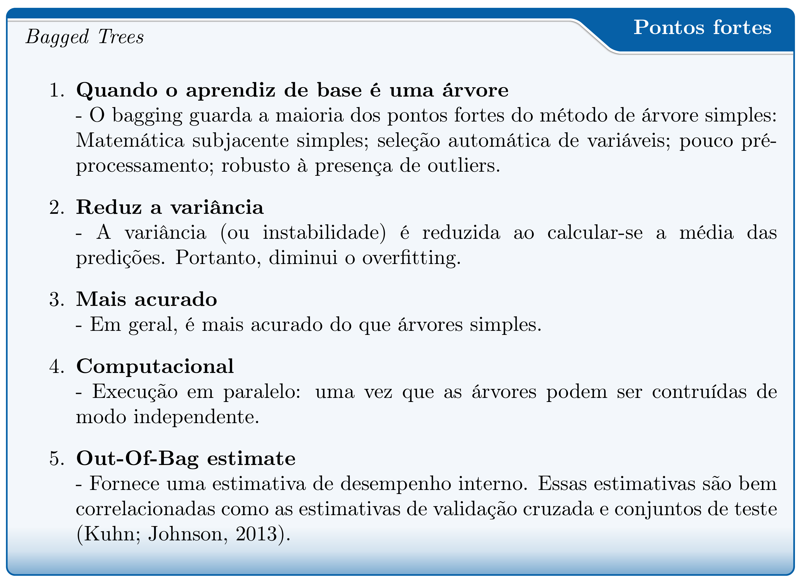
```
.left[.footnote[**Fonte**: O Autor.]]
]

--

.pull-right-4[
```{r, echo=FALSE, out.width='100%', fig.align='center', fig.cap='', dpi=600}
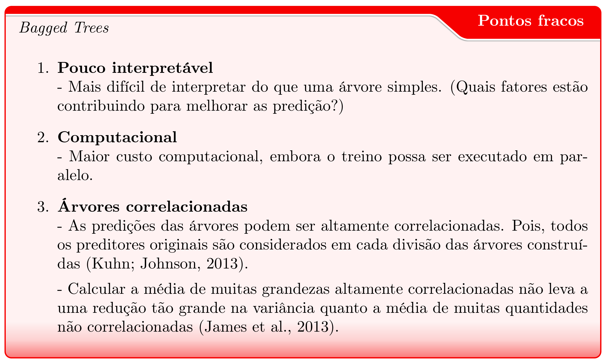
```
]

<!--Slide XX -->
---
name: rf
class: inverse, middle, left
background-image: url(fig/white.jpg)
background-size: cover

.font200[**Random Forest**]

`r Citep(myBib, "breiman2001random", .opts = list(max.names = 1, longnamesfirst = F))`

<!-- Slide XX -->
---
# Random Forest

.pull-left-1[
```{r, echo=FALSE, out.width='80%', fig.align='center', fig.cap='', dpi=600}
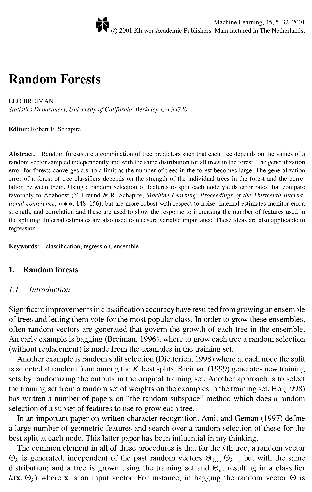
```
.center[Fonte: [link.springer.com](https://link.springer.com/article/10.1023/A:1010933404324)]

]

.pull-right-2[
**Informações gerais:**
- **Random Forest**: um algoritmo baseado em conjunto de árvores;
- **Proposto**: `r Citet(myBib, "breiman2001random")`;
- **Problemas**: Classificação e Regressão; e
- **Hiperparâmetro tuning**: .red[mtry] (número de preditoras amostradas aleatoriamente como candidatas em cada divisão).
]

<!--Slide 18 -->
---
# Random Forest

.pull-left-6[
.blockquote[
- **Ideia principal:**

  - É uma modificação substancial do *bagging*, e objetiva construir uma **coleção de árvores não correlacionadas** e, em seguida, calcular a média das predições individuais (no caso de regressão) `r Citep(myBib, "hastie2016elements")`.<br>


- **Motivos**:
  - Bagging **não reduz de maneira ideal a variância** das predições, pois as árvores são correlacionadas (topo da árvore) `r Citep(myBib, "kuhn2013applied")`.
  
  - Portanto, calcular a **média** de predições de **árvores não correlacionadas** reduz de maneira ideal a **variância**.


- **Aprediz de base**:
  - Árvores de regressão, que possui alta variância.
]
]

<!--Slide XX -->
---
# Random Forest

.pull-left-2[
.blockquote[
.center[**Bagging** e **Random Forest**: Diferença?]

A principal diferença entre o **Bagging** e o **Random Forest** é a escolha do tamanho **p** no espaço de preditores originais `r Citep(myBib, "james2013introduction", .opts = list(max.names = 1, longnamesfirst = F))`.
]
]

.pull-right-7[
.blockquote[

**No caso de regressão...**

**Passo 1** - Dado um conjunto de treinamento original $L$ de tamanho $n$, gerar uma amostra *bootstrap* $bi$ de tamanho $n$;

**Passo 2** - Treinar um modelo de árvore de regressão (profunda e não podada) usando a amostra *bootstrap* $bi$. Porém, ao crescer cada árvore fazer a seguinte modificação:

a) Em cada nó de decisão, selecionar um subconjunto aleatório de $m$ preditoras;

b) A melhor divisão será escolhida dentre as $m$ preditoras candidatas.

**Passo 3** - Salvar o modelo preditivo.

]
]

---
# Random Forest

```{r, echo=FALSE, out.width='100%', fig.align='center', fig.cap='', dpi=600}
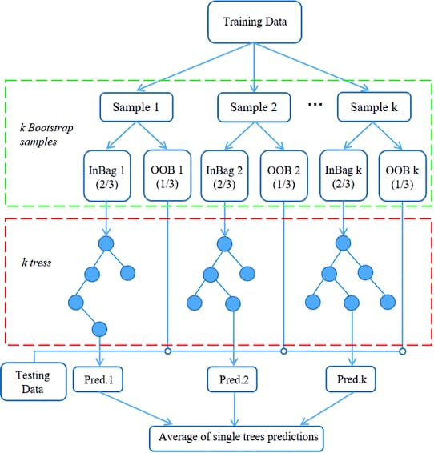
```

<!--Slide 19 -->
---
# Random Forest

.panelset[
.panel[.panel-name[Dados]
.pull-left-1[

.scroll-box-20[
```{r, echo=FALSE, eval=TRUE}
data <- data.table::fread("R-scripts/Cedrela.csv")

data %>% kable(format= "html") %>%
  kable_styling(full_width = F, bootstrap_options = c("striped", "hover", "condensed"), font_size = 18)

```

]]

.pull-right-2[
**Implementação no R** (exemplo de brinquedo!)

```{r, echo=TRUE, eval=TRUE, message=FALSE, warning=FALSE}
library(randomForest)

data <- data.table::fread("R-scripts/Cedrela.csv")

set.seed(1)
rf <- randomForest(V ~ D + H, 
             data = data,
             ntree = 10,       # número de árvores (padrão = 500)
             mtry = 1,         # número de preditoras (padrão = p/3)
             maxnodes = NULL,  # número de nós terminais
             importance = TRUE # importância das preditoras
             )
```

]
]

.panel[.panel-name[f(x)]

.pull-left-2[
```{r, echo=FALSE, fig.width=5, fig.height=3, fig.cap="", message=FALSE}

pred <- predict(rf, newdata=data, predict.all=T)

dfrf <- pred %>% 
  as.data.frame() %>%
  bind_cols(data) %>%
  rename_at(vars(starts_with('ind')), ~ paste("Tree", 1:10)) %>%
  rename_at(vars(aggregate),~"randomForest") %>%
  tidyr::pivot_longer(starts_with(c("Tree", "rand")),
                    names_to = "Tree",
                    values_to = "Pred") %>%
  mutate_if(is.character, as.factor)

gg5 <- dfrf %>%
  filter(Tree != "randomForest") %>%
  group_by(Tree) %>% 
  plot_ly(x = ~D, y = ~V, colors = "Paired",
          type = 'scatter', mode = 'markers') %>% 
  add_lines(y = ~ Pred, color = ~ Tree, mode = 'lines') %>%
  layout(title="",
         font = list(size = 14),
         xaxis=list(title="Diâmetro (cm)"),
         yaxis=list(title="Volume (m3)")) %>%
  add_lines(data = subset(dfrf, Tree == 'randomForest'),
            y = ~ Pred, mode = 'lines',
            name = 'randomForest',
            line = list(color = 'black', 
                        width = 4)) 

htmltools::tagList(gg5)

```
]
]
]


<!--Slide XX -->
---
# Random Forest: pontos fortes e fracos...

.pull-left-4[
```{r, echo=FALSE, out.width='100%', fig.align='center', fig.cap='', dpi=600}
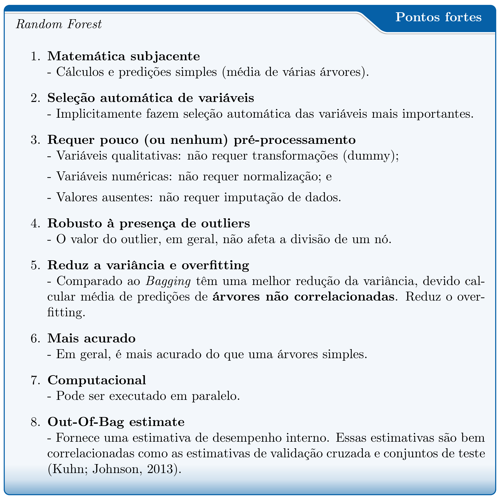
```
.left[.footnote[**Fonte**: O Autor.]]
]

--

.pull-right-4[
```{r, echo=FALSE, out.width='100%', fig.align='center', fig.cap='', dpi=600}
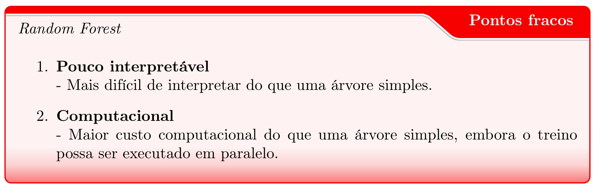
```
]


<!--Slide XX -->
---
name: out
class: inverse, middle, left
background-image: url(fig/white.jpg)
background-size: cover

.font200[**Outros (M5', ...)**]

.font100[**Existem dezenas de algoritmos por experimentar...**]


<br>.font100[**CARET: Mais de 200 algoritmos para aprendizado supervisionado.**]

<!--Slide XX -->
---
# Model Tree - M5'

.pull-left-1[
```{r, echo=FALSE, out.width='100%', fig.align='center', fig.cap='', dpi=600}
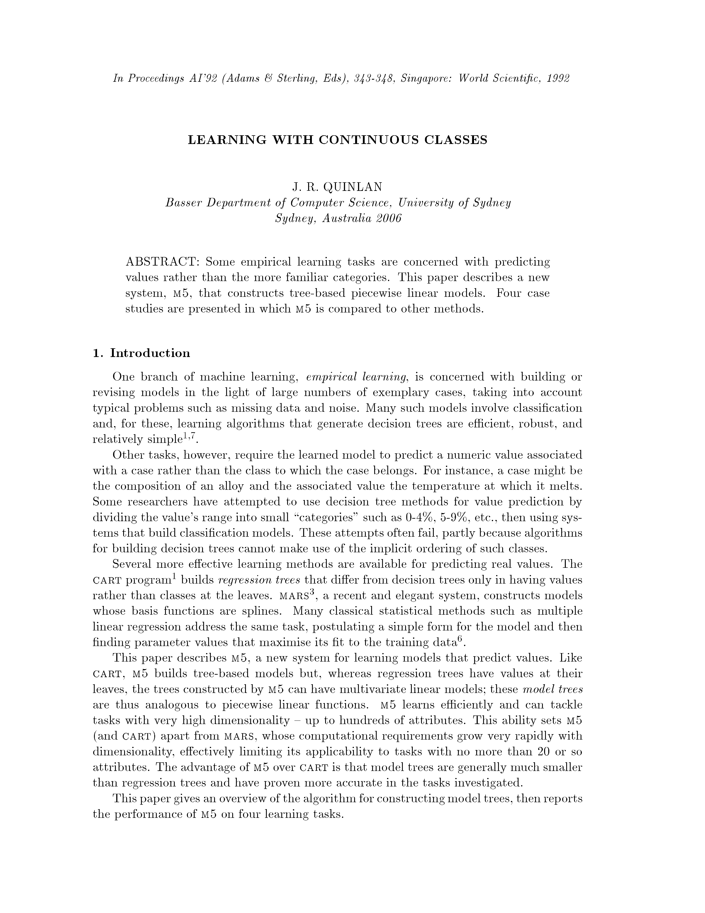
```
.center[Fonte: [citeseerx](http://citeseerx.ist.psu.edu/viewdoc/summary?doi=10.1.1.34.885)]
]

.pull-right-2[
**Informações gerais:**
- **Model Tree - M5'**: um algoritmo baseado árvores;
- **Proposto**: `r Citet(myBib, c("quinlan1992learning", "wang1997induction"))`;
- **Problema**: Regressão; e
- **Hiperparâmetro tuning**: .red[pruned]: (com poda?); .red[smoothed]: (com suavização?)


O M5' foi introduzido por `r Citet(myBib, "wang1997induction")` e aprimorou o algoritmo M5 originalmente proposto por `r Citet(myBib, "quinlan1992learning")`.

]


<!--Slide XX -->
---
# Model Tree - M5' 

.pull-left-3[
.blockquote[
- **Ideia principal:**
  
  - Ao contrário das árvores de regressão, as árvores modelos
  usam **modelos lineares** para predições nos **nós terminais**.

  - Surgiu como uma **alternativa** à árvore de regressão para predição de **variáveis contínuas**.

]
]

.pull-right-3[
```{r, echo=FALSE, out.width='100%', fig.align='center', fig.cap='', dpi=600}
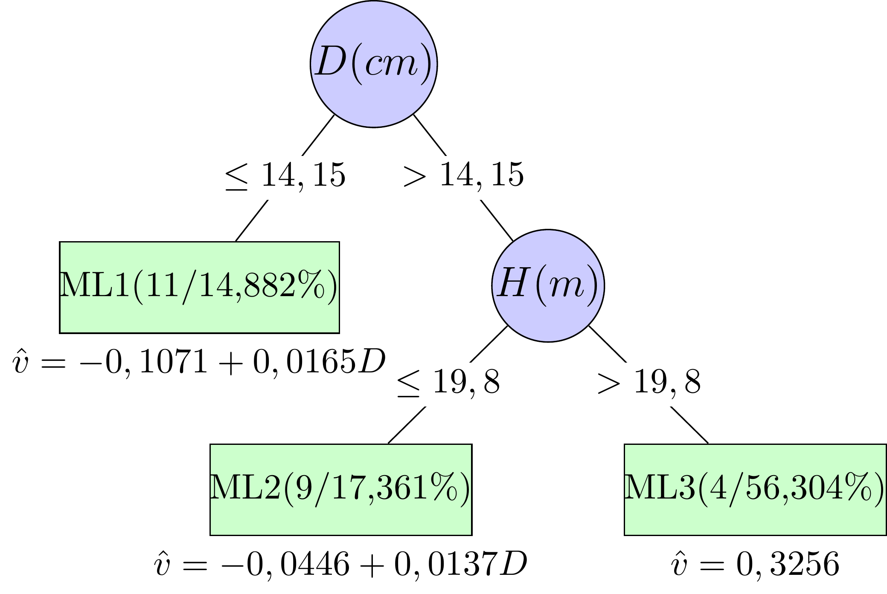
```
]

<br>
.center[.content-box-green[**Vejo um grande potencial desse algoritmo para Mensuração Florestal!**]]


<!--Slide XX -->
---
# Outros algoritmos
<br>

- **k-Nearest-Neighbor** - k-NN (variações: wkNN)

- **Stochastic Gradient Boosting** - SGB

- **Artificial Neural Networks** - ANN

- **Support Vector Regression** - SVR

- **Extreme Gradient Boosting** - XGBoost


<!--Slide XX -->
---
name: mr
class: inverse, middle, left
background-image: url(fig/white.jpg)
background-size: cover

.font200[**Métodos de Reamostragem**]

.font100[**Como escolher dentre diversos <br> modelos de aprendizado de máquina?**]

<!--Slide XX -->
---
# Métodos de Reamostragem

.pull-left-2[
.blockquote[
- **Motivação**

  - Precisa-se de um mecanismo para **escolher o melhor modelo** dentre diversos.


- **Melhor modelo**

  - *Grosso modo*, é aquele que possui a melhor capacidade de **predizer novas observações** (menor erro de predição).


- **Desempenho preditivo** 

  - Assim sendo, é fundamental **estimar o desempenho esperado** de um modelo preditivo quando usado para predizer **novas observações**.

]
]

.pull-right-1[

<br><br><br>Os métodos de reamostragem são usados para estimar o desempenho de um modelo em predizer novas observações. <br>

A abordagem mais usual é usar algum tipo de **validação cruzada**.
]

<!--Slide XX -->
---
# Métodos de Reamostragem

<br> **Mas, antes disso...**

.blockquote[
**Tipos de conjuntos de dados...** <br>


<br>Existem três tipos de conjuntos de dados `r Citep(myBib, "witten2017data", .opts = list(max.names = 1, longnamesfirst = F))`:


- **Conjunto de treinamento** (aprendizado) 
    - Usado para construir/aprender/treinar os modelos preditivos (classificação ou regressão).
    
    
- **Conjunto de validação**
    - Usado para otimizar os hiperparâmetros dos modelos e escolher a configuração de melhor desempenho preditivo.
    

- **Conjunto de teste**
  - Usado para estimar o desempenho preditivo final do modelo otimizado (*tuning model*). 
    
]

<!--Slide XX -->
---
# Métodos de Reamostragem

.pull-left-2[
.blockquote[
**Tipos de validação cruzada...** <br>

- **Hold-out validation**
    
- **k-fold Cross-Validation**

- **Repeated k-fold cross validation**

- **Leave-One-Out Cross-Validation**
]
]

<!--Slide XX -->
---
# .font80[Métodos de Reamostragem: Hold-out validation]
<br>

.pull-left-3[

```{r, echo=FALSE, out.width="90%"}
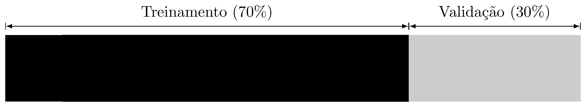
```
.left[.footnote[**Fonte**: O Autor.]] 
]


.pull-right-3[
.center[**Implementação**]

**1** - Dividir o conjunto de dados em duas partes:
**treinamento** e **validação**.

  - Comumente: 70%/30% ou 80%/20% (treino/validação)

**2** - Usar uma parte para treinar o modelo (70% ou 80%), e a outra para validar (30% ou 20%).

**3** - Calcular o desempenho no conjunto de validação.
]

--
<br>

.pull.bottom[
.pull-left-3[
.shadow[
<br>.center[**Ponto Fraco**]

- **Alta variância**: 

  - A estimativa é muito dependente da divisão (ou observações) que são alocadas em cada conjunto.

  - Portanto, não é considerada a abordagem mais adequada para estimar o erro de generalização.

]
]
]

<!--Slide XX -->
---
# .font80[Métodos de Reamostragem: k-fold Cross-Validation]

.pull-left-3[
```{r, echo=FALSE, out.width="90%"}
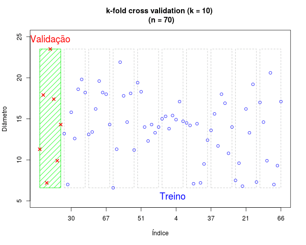
```
.left[.footnote[**Fonte**: O Autor.]] 

**Repeated k-fold cross validation**: Simplesmente repete-se o processo (1 a 4) por $m$ vezes.
]


.pull-right-3[
.scroll-box-20[

.center[**Implementação**]

**1** - Dividir o conjunto de treinamento em k partições iguais e disjuntas; (5 ou 10)

  - Se k = 10 e existem 70 observações;
  - Então, cada partição teria 7 observações.

**2** - Usar k-1 partições para treinar o modelo e avaliar na partição que ficou de fora.

  - Conjunto de treinamento: 9 partições (63 obs.); e
  - Conjunto de validação: 1 partição (7 obs.).

**3** - Calcular o desempenho no conjunto de validação (ex.: RMSE)

**4** - Repetir as etapas 1, 2 e 3 por k vezes.

**5** - Calcular o desempenho médio no conjunto de validação.
]
]


<!--Slide XX -->
---
# .font80[Métodos de Reamostragem: Leave-One-Out Cross-Validation]

.pull-left-3[
```{r, echo=FALSE, out.width="90%"}
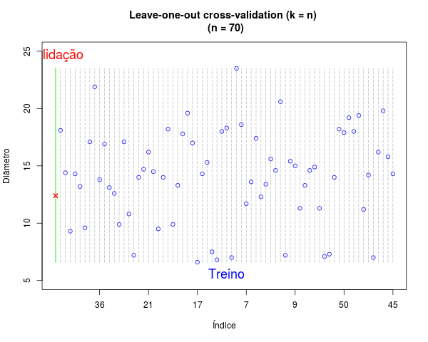
```
.left[.footnote[**Fonte**: O Autor.]] 
]

.pull-right-3[
.scroll-box-20[

.center[**Implementação**]

**1** - Dividir o conjunto de treinamento em k = n partições;

- Em que: n = número de observações (n = 70).

**2** - Usar k-1 partições para treinar o modelo e avaliar na partição que ficou de fora.

  - Conjunto de treinamento: 69 partições (69 obs.); e
  - Conjunto de validação: 1 partição (1 obs.).

**3** - Calcular o desempenho no conjunto de validação.

**4** - Repetir as etapas 1, 2 e 3 por k vezes.

**5** - Calcule o desempenho médio no conjunto de validação.
]
]


<!-- Slide XX -->
<!-- --- -->
<!-- # Qual método de validação usar? -->

<!-- **Não existe uma regra de ouro!** -->

<!-- **Mas, existem algumas orientações gerais...** -->

<!-- - **k-fold Cross-Validation** -->
<!--   - Quando o conjunto de dado disponível é de tamanho médio a grande; e -->
<!--   - Mais adequado para métodos com muitos hiperparâmetros de ajuste; -->
<!--   - Custo computacional é maior do que Hold-out validation. -->

<!-- - **Leave-One-Out Cross-Validation** -->
<!--   - Quando o conjunto de dado disponível é de tamanho limitado; e -->
<!--   - Mais adequado para métodos com poucos hiperparâmetros de ajuste; -->
<!--   - Custo computacional é maior do que k-fold Cross-Validation. -->


<!--Slide XX -->
---
name: md
class: inverse, middle, left
background-image: url(fig/white.jpg)
background-size: cover

.font200[**Medidas de Desempenho**]

.font100[**É necessário uma função custo para medir o erro de predição...**]

<!--Slide XX -->
---
# Medidas de desempenho
<br>

- **Root Mean Square Error** (RMSE) / **Raiz do Erro Quadrático Médio** (REQM)

\begin{equation}
{RMSE_{(k)}} =\sqrt{\frac{1}{n}\displaystyle\sum\limits_{i=1}^n\bigg(\hat{y_i}-y_i\bigg)^2}\\\\
\label{eq:RMSE}
\end{equation}


- **Relative Root Mean Square Error** (rRMSE)

\begin{equation}
{rRMSE_{(k)}} =\frac{100}{\bar{y}}\sqrt{\frac{1}{n}\displaystyle\sum\limits_{i=1}^n\bigg(\hat{y_i}-y_i\bigg)^2}\\\\
\label{eq:rRMSE}
\end{equation}


- **Mean Absolute Error** (MAE)

\begin{equation}
{MAE_{(k)}} =\frac{1}{n}\displaystyle\sum\limits_{i=1}^n|\hat{y_i}-y_i|\\\\
\label{eq:MAE}
\end{equation}


<!-- Slide XX -->
---
# Medidas de desempenho
<br>

- **Coefficient of Determination** (R²)

\begin{equation}
{R_{(k)}^2} =\left(\frac{\displaystyle\sum\limits_{i=1}^n
\bigg(\hat{y_i}-\bar{\hat{y}}\bigg)
\bigg(y_i-\bar{y}\bigg)}
{\sqrt{\left [\displaystyle\sum\limits_{i=1}^n
\bigg(\hat{y_i}-\bar{\hat{y}}\bigg)^2 \right ]
\left [\displaystyle\sum\limits_{i=1}^n\bigg(y_i-\bar{y}\bigg)^2 \right]}}\right)^2\\\\
\label{eq:R2}
\end{equation}


- **Prediction Residual Error Sum of Squares** (PRESS)

\begin{equation}
PRESS = \displaystyle\sum\limits_{i=1}^n\bigg(y_i-\hat{y}_{i,-i}\bigg)^2 %\displaystyle\sum\limits_{i=1}^n\bigg(\frac{y_i-\hat{y}_{i}}{1-h_{ii}}\bigg)^2
\label{eq:PRESS}
\end{equation}

A estatística $PRESS$ é baseada na abordagem **Leave-One-Out Cross Validation** (LOOCV).

Os erros de predição para as **amostras de validação** são elevados ao quadrado e somados para formar a estatística PRESS.

< PRESS $\rightarrow$ melhor modelo


<!-- Slide XX -->
---
class: inverse, middle, left
background-image: url(fig/white.jpg)
background-size: cover

.font200[**Parte 2** <br> .green[Aprendizado de máquina <br> com linguagem R]]


<!-- Slide XX -->
---
name: bctv
class: inverse, middle, left
background-image: url(fig/white.jpg)
background-size: cover

.font200[**Bibliotecas no Cran Task View**]
<br>

.pull-left-2[
Fornecer uma orientação sobre os pacotes disponíveis no repositório CRAN que são relevantes para tarefas relacionadas a um determinado tópico.
]

<!-- Slide XX -->
---
class: middle
# Bibliotecas no Cran Task View

.pull-left[

Alguns pacotes publicados no Cran Task View: Machine Learning & Statistical learning

```{r, echo=FALSE, out.width='85%', fig.align='center', fig.cap='', dpi=600}
knitr::include_graphics('fig/ML-FR.png')
```
]

.pull-right[
<BR> <BR> <BR> <BR> <BR>
Veja outros pacotes disponíveis em Task View:

[Machine Learning & Statistical learning](https://cran.r-project.org/)

<BR> <BR>
Web scraping feito em 21/07/2018:

Até julho de 2018 existiam 102 pacotes sobre AM
publicados no CRAN Task View.
]

.left[.footnote[Fonte: O Autor.]]


<!-- Slide XX -->
---
name: caret
class: inverse, left
background-image: url(fig/white.jpg)
background-size: cover

.font300[CARET]
	
.font200[(.red[C]lassication .red[A]nd .red[Re]gression .red[T]raining)]
	
`r Citep(myBib, c("kuhn2013applied", "R-caret"))`.
		
.font120["Constitui um conjunto de funções que tentam simplificar <br> o processo de construção de modelos preditivos."]

<br> <br> <br>

Web page: [CARET Package](https://topepo.github.io/caret/index.html)

<br> <br>

.left[.footnote[Imagem de <a href="https://pixabay.com/pt/users/pen_ash-5526837/?utm_source=link-attribution&amp;utm_medium=referral&amp;utm_campaign=image&amp;utm_content=5358904">pen_ash</a> por <a href="https://pixabay.com/pt/?utm_source=link-attribution&amp;utm_medium=referral&amp;utm_campaign=image&amp;utm_content=5358904">Pixabay</a>]]


<!-- Slide XX -->
---
# Pacote CARET: Ferramentas

```{r, echo=FALSE, out.width='50%', fig.align='center', fig.cap='', dpi=600}
knitr::include_graphics('fig/CARET.png')
```


<!-- Slide XX -->
---
name: fluxo
background-image: url(fig/white.jpg)
background-size: cover

# .font80[Fluxograma: aprendizado de MAM usando CARET]

```{r, echo=FALSE, out.width='90%', fig.align='center', fig.cap=''}
knitr::include_graphics('fig/FM.png')
```
.left[.footnote[Fonte: `r Citet(myBib, "souza2020Tese")`.]]


<!-- Slide XX -->
---
name: exR
class: inverse, left
background-image: url(fig/white.jpg)
background-size: cover

.font200[Modelagem no R: uma rápida intuição]
<br><br>

.font150[Acesse o código R:]

Link: [01-wkNN](https://deivisonsouza.github.io/ML-Mensuracao-Florestal/R-scripts/01-wkNN.R)

.font100[(.green[Weighted *k*-Nearest Neighbors])]

.pull-left-2[
.font100[Uma variação do *k*-NN que usa funções kernel para ponderar os vizinhos mais próximos de uma determinada observação...]

<br>

.font150[Acesse os dados:]

Link: [Tectona-grandis](https://deivisonsouza.github.io/ML-Mensuracao-Florestal/R-scripts/Tectona.csv)
]


<!-- Slide XX -->
---
name: shiny
class: inverse, top
background-image: url(fig/white.jpg)
background-size: cover

Como disponibilizar os modelos de aprendizado de máquina?

.pull-left[
```{r, echo=FALSE, out.width='20%', fig.align='center', fig.cap=''}
knitr::include_graphics('fig/sh.png')
```

.thick[.black[Biblioteca Shiny]]

.black[Biblioteca que facilita a criação de aplicativos da Web interativos usando diretamente a Linguagem R.]

.thick[.black[Shinyapps.io:]]

.black[Servidor gratuito para hospedar os aplicativos Shiny.]
<BR>

.thick[.black[Acesse aplicações Web para predição de biomassa e volume: (Souza, 2020)]]

.font80[
[1-Shiny-MLMBio-Biomassa](https://deivisonsouza.shinyapps.io/MLBiomass/)

[2-Shiny-MLMVol-Volume](https://deivisonsouza.shinyapps.io/MLVolume/)
]
]

.column-right[
.thick[.black[Acesse a base para uso na aplicação MLMBio:]] [Biomass-data](https://deivisonsouza.github.io/IA-Potencial-IF/R-scripts/data.csv)]

]


<!-- Slide XX -->
---
class: inverse, middle, left
background-image: url(fig/white.jpg)
background-size: cover

.font250[**Aplicações nas ciências <br> florestais**]


<!-- Slide XX -->
---
name: aplicacoes
# Aplicações nas ciências florestais

```{r, echo=FALSE, out.width='57%', fig.align='center', fig.cap=''}
knitr::include_graphics('fig/MindMap.png')
```

.left[.footnote[Fonte: O Autor.]]

<!-- Slide XX -->
---
name: AMIF
# .font80[AM na Mensuração Florestal: estudos indicam potencial!]

```{r, echo=FALSE, out.width='80%', fig.align='center', fig.cap='', dpi=600}
knitr::include_graphics('fig/ML-TEC.png')
```
.left[.footnote[Fonte: O Autor.]]

```{r}
Citep(myBib, c("diamantopoulou2010modelling", "nieto2012support", "sanquetta2013use", "diamantopoulou2005artificial", "ozccelik2010estimating", "schikowski2015estudo", "nunes2016artificial", "Corte2020", "montano2017artificial", "korhonen1997application", "maltamo2001most", "fehrmann2008comparison", "sanquetta2015comparison", "sanquetta2018volume", "souza2019",
               "james2013introduction"))
```

<!--Slide XX -->
---
# AM na Mensuração Florestal: Volume

**Algumas pesquisa de AM na predição do volume...**

```{r, echo=FALSE, out.width='100%', fig.align='center', fig.cap='', dpi=600}
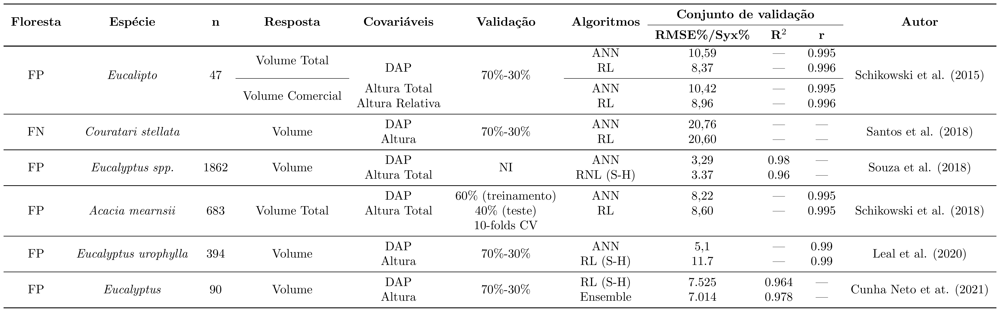
```
FP = Floresta Plantada; FN = Floresta Nativa; ANN = Artificial Neural Network. RL = Regressão Linear. S-H = Schumacher-Hall.


<!--Slide XX -->
---
# AM na Mensuração Florestal: Altura

**Algumas pesquisa de AM na predição da altura...**

```{r, echo=FALSE, out.width='100%', fig.align='center', fig.cap='', dpi=600}
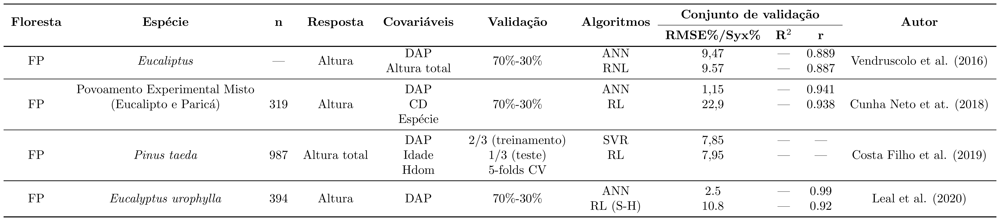
```
FP = Floresta Plantada; FN = Floresta Nativa; ANN = Artificial Neural Network. RL = Regressão Linear. S-H = Schumacher-Hall.


<!--Slide XX -->
---
name: cf
# Considerações finais

.center[.font150[**Percepções sobre as pesquisas...**]]
<br>

**Sob a ótica preditivista...**

.blockquote[
.center[**Aprendizado de Máquina x Métodos Tradicionais**]

<br>**1 - Desempenho preditivo**

É fato que MAM têm mostrado competitividade, em termos de desempenho preditivo, frente aos métodos tradicionais.


<br>**2 - Superioridade**

a) Existem relatos de maior acurácia para MAM (ex.: RNA);

b) No entanto, isso nem sempre acontece e muitas vezes os **ganhos de acurácia não parecem ser expressivos**; e

c) Nestes casos (item b), invocar o **princípio da parcimônia** (escolher o modelo mais simples) parece ser mais plausível.
]

<!--Slide XX -->
---
# Considerações finais

.center[.font150[**Percepções sobre as pesquisas...**]]
<br>

**Sob a ótica preditivista...**

.blockquote[
.center[**Aprendizado de Máquina x Métodos Tradicionais**]

<br>**3 - Covariáveis tradicionais** 

<br>a) Algumas pesquisas consideram **apenas o uso de covariáveis tradicionais** para ajustar MAM.


<br>b) Neste casos (item a), na maioria das vezes, os MAM **não apresentam acurácia superior** em relação aos modelos clássicos (ex.: Schumacher-Hall).


<br>c) A **adição de novas covariáveis** (qualitativas e quantitativas) parece contribuir para o aumento da acurácia. Neste ponto, é possível que MAM 
de modo mais expressivo quando usados MAM...
]

<!--Slide XX -->
---
# Considerações finais

.center[.font150[**Relexões para pesquisas futuras...**]]

.blockquote[
**1 - Novas preditoras para aumento da acurácia**

- Refletir a possibilidade de inclusão de novas preditoras;

- Ponderar **diferentes abordagens** de modelagem e **refletir novas variáveis preditoras**, parece ser o caminho a
seguir na buscar por modelos biométricos mais acurados.
]


---
# Referências
<br>

```{r refs1, echo=FALSE, results="asis"}
PrintBibliography(myBib, start = 1, end = 5)
```

---
# Referências
<br>

```{r refs2, echo=FALSE, results="asis"}
PrintBibliography(myBib, start = 6, end = 10)
```

---
# Referências
<br>

```{r refs3, echo=FALSE, results="asis"}
PrintBibliography(myBib, start = 11, end = 15)
```
---
# Referências
<br>

```{r refs4, echo=FALSE, results="asis"}
PrintBibliography(myBib, start = 16, end = 20)
```

---
# Referências
<br>

```{r refs5, echo=FALSE, results="asis"}
PrintBibliography(myBib, start = 21, end = 25)
```
---
# Referências
<br>

```{r refs6, echo=FALSE, results="asis"}
PrintBibliography(myBib, start = 26, end = 29)
```

---
class: inverse, top
background-image: url(fig/white.jpg)
background-size: cover

.pull-left[
.font300[Obrigado!]
 <br> <br> <br>

**Email**: <a href="mailto:deivisonvs@ufpa.br">deivisonvs@ufpa.br</a>

**Github**: <a href="https://github.com/DeivisonSouza">@DeivisonSouza</a>

<br>

.shadow[
Os slides, códigos e demais arquivos desta apresentação estão disponíveis no repositório GitHub: [ML-Mensuracao-Florestal](https://github.com/DeivisonSouza/ML-Mensuracao-Florestal).
]
]

<!-- # Modelagem preditiva: linguagens (softwares) e frameworks -->

<!-- ```{r, engine='tikz', cache=TRUE, echo=FALSE, out.width='50%', fig.ext = 'png', bg = "transparent"} -->
<!-- \usetikzlibrary{mindmap} -->
<!-- \begin{tikzpicture} -->
<!-- 		[mindmap, -->
<!-- 		every node/.style={concept, execute at begin node=\hskip0pt, font=\bfseries}, -->
<!-- 		root concept/.append style={concept color=black, fill=white, line width=1ex, text=black, font=\huge\bfseries}, -->
<!-- 		method a/.style={concept color=red, line width=1ex, text=white}, -->
<!-- 		method b/.style={concept color=orange, line width=1ex, text=white}, -->
<!-- 		method c/.style={concept color=brown, line width=1ex, text=white}, -->
<!-- 		methods a/.style={concept color=red!50, line width=1ex, text=black}, -->
<!-- 		methods b/.style={concept color=orange!50, line width=1ex, text=black}, -->
<!-- 		methods c/.style={concept color=brown!50, line width=1ex, text=black}, -->
<!-- 		grow cyclic, -->
<!-- 		level 1/.append style={level distance=4.5cm, sibling angle=60}, -->
<!-- 		level 2/.append style={level distance=3cm, sibling angle=45}] -->
<!-- 		\node [root concept] {Liguagens/ \\ Software} % root -->
<!-- 		child [missing] {} -->
<!-- 		child [missing] {} -->
<!-- 		child [missing] {} -->
<!-- 		child [method a] { node {Python} -->
<!-- 			child [methods a] { node {A1} } -->
<!-- 			child [methods a] { node {A2} } -->
<!-- 			child [methods a] { node {A3} } -->
<!-- 			child [methods a] { node {A4} } -->
<!-- 			child [methods a] { node {A5} } -->
<!-- 			child [methods a] { node {A6} } -->
<!-- 			child [methods a] { node {A7} } } -->
<!-- 		child [missing] {} -->
<!-- 		child [method b] { node {R} -->
<!-- 			child [methods b] { node {B1} } -->
<!-- 			child [methods b] { node {B2} } -->
<!-- 			child [methods b] { node {B3} } -->
<!-- 			child [methods b] { node {B4} } -->
<!-- 			child [methods b] { node {B5} } -->
<!-- 			child [methods b] { node {B6} } -->
<!-- 			child [methods b] { node {B7} } } -->
<!-- 		child [missing] {} -->
<!-- 		child [method c] { node {Weka} -->
<!-- 			child [methods c] { node {C1} } -->
<!-- 			child [methods c] { node {C2} } -->
<!-- 			child [methods c] { node {C3} } -->
<!-- 			child [methods c] { node {C4} } -->
<!-- 			child [methods c] { node {C5} } -->
<!-- 			child [methods c] { node {C6} } -->
<!-- 			child [methods c] { node {C7} } }; -->
<!-- 		\end{tikzpicture} -->
<!-- ``` -->


